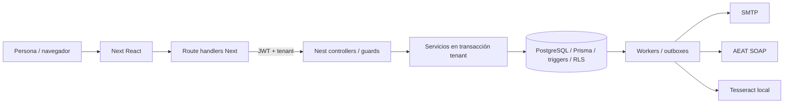
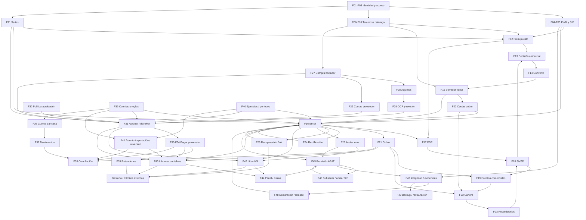

# Auditoría de flujos de negocio — PastaGansa

## 1. Resumen ejecutivo

1. Auditoría estática del repositorio en el commit `904ef19`; no se ha ejecutado la aplicación, consultado datos reales ni modificado código.
2. ERP transaccional modular: Next.js/React → BFF Next → API NestJS → Prisma/PostgreSQL (`apps/web/src/lib/server-session.ts`, `apps/api/src/app.module.ts`).
3. Se inventarían **49 flujos**, incluyendo variantes relevantes y funciones expuestas solo por API; no se equiparan especificaciones con implementación.
4. Ventas conectan presupuestos, facturas, cobros, contabilidad, libro IVA y SIF (`apps/api/src/invoices/invoices.service.ts::issue`).
5. Compras incorporan adjuntos, OCR supervisado, aprobación multinivel, retenciones, suplidos y servicios UE (`apps/api/src/purchases/purchases.service.ts`).
6. OCR solo procesa PNG/JPEG y su revisión no actualiza la factura; PDF se archiva, no se extrae (`apps/api/src/purchases/purchase-ocr.service.ts::queue/review`).
7. Existen outboxes SMTP y AEAT, cadenas fiscales y auditoría; **no** constituyen un event store general reconstruible (`apps/api/prisma/schema.prisma`).
8. Reglas repartidas entre UI, BFF, servicios y triggers; la migración debe conservar atomicidad, aislamiento, idempotencia e inmutabilidad.
9. [INFERIDO] Primeros candidatos IA: recepción de compras/OCR y conciliación asistida; emisión y correcciones fiscales deben permanecer deterministas y supervisadas.
10. Código de producción SIF no equivale a conformidad acreditada: los documentos del proyecto mantienen bloqueos (`docs/17_manual_evidencias_conformidad_sif.md`, `docs/19_preparacion_declaracion_responsable_sif.md`).

## 2. Arquitectura actual

### 2.1 Stack, carpetas y comunicación

| Capa / carpeta | Evidencia y funcionamiento |
|---|---|
| Monorepo | npm workspaces `apps/*`, Node >=22, TypeScript; scripts de build/test/migración en `package.json`. |
| Frontend `apps/web/src/app` | Next 16.3.4, React 19.2.8, App Router; rutas acceso, seguridad, inicio, configuración, clientes, catálogo, presupuestos, facturas, compras, cartera, tesorería y contabilidad (`apps/web/package.json`, `apps/web/src/components/app-shell.tsx`). |
| Estado y formularios | React Query 5 para consultas/mutaciones; Zod 4; esquemas y presentadores en `apps/web/src/lib`; componentes específicos en cada carpeta de pantalla y comunes en `apps/web/src/components`. Ejemplos: `apps/web/src/app/facturas/[id]/invoice-detail.tsx`, `apps/web/src/lib/invoices.ts`. |
| BFF `apps/web/src/app/api` | Route handlers validan petición y llaman `/v1/...`. `apps/web/src/lib/server-session.ts::tenantApiRequest` resuelve sesión, añade Bearer JWT y cabeceras `x-organization-id`/`x-company-id`. Cookies HttpOnly `pg_access`, `pg_refresh`, `pg_tenant`; refresh al caducar acceso. No es una segunda persistencia. |
| API `apps/api/src` | NestJS 11/Express, módulos por dominio, controllers → servicios. `apps/api/src/main.ts::bootstrap`: prefijo `/v1`, Swagger `/docs`, Helmet, ValidationPipe transform/whitelist/forbidNonWhitelisted. Guards de autenticación, tenant y permisos; throttling global en `apps/api/src/app.module.ts`. |
| Lógica | Servicios orquestan acciones de negocio y cálculos Decimal. Ejemplo emisión → `TaxService.postInvoice` + `AccountingService.postSalesInvoice` + `SifService.createRegistration` en `apps/api/src/invoices/invoices.service.ts::issue`. No hay un bus general de comandos/eventos. |
| Persistencia | Prisma 6.12/PostgreSQL; 52 modelos en `apps/api/prisma/schema.prisma`. SQL evolutivo con checks, claves, RLS, funciones y triggers en `apps/api/prisma/migrations`. `schema.prisma` **no refleja todos los invariantes SQL**. |
| Unidad transaccional | `apps/api/src/tenancy/tenant-context.interceptor.ts::intercept` envuelve cada petición tenant en una transacción; fija `app.organization_id` y `app.company_id`, timeout 15 s o 120 s. `apps/api/src/tenancy/tenant-context.service.ts` proporciona contexto y cliente transaccional. |
| Trabajos asíncronos | Polling en procesos Nest, no broker: email y OCR cada 5 s, leases y `SKIP LOCKED`; AEAT cada 5 s con espera fiscal y dependencia del predecesor; runtime NO VERI*FACTU cada 30 s. Fuentes: `apps/api/src/invoices/invoice-email-outbox.worker.ts`, `apps/api/src/purchases/purchase-ocr.worker.ts`, `apps/api/src/sif/aeat-test.worker.ts`, `apps/api/src/sif/sif-no-event.runtime.ts`. |
| Infraestructura | Docker/Compose para local, staging, producción y overlays SIF; `docker/`, `docker-compose.production.yml`, `docker-compose.sif-verifactu-production.yml`, `docker-compose.sif-no-production.yml`. Scripts operativos en `scripts/`; documentación de diseño/operación en `docs/`. |
| Pruebas / observabilidad | Jest API, Vitest web, Playwright e integración PostgreSQL (`apps/api/package.json`, `apps/web/package.json`, `apps/api/test/`, `apps/web/e2e/`). Logs JSON, request ID, métricas Prometheus en `apps/api/src/platform`; no se han ejecutado pruebas en esta auditoría. |

### 2.2 Invariantes transversales e historia

Estas reglas se aplican a todos los flujos tenant del inventario; no se repiten íntegramente en cada ficha:

- **G1 — autoridad y aislamiento:** `apps/api/src/identity/authentication.guard.ts`, `apps/api/src/tenancy/tenant.guard.ts::canActivate`, `apps/api/src/authorization/permissions.guard.ts`; los IDs de cabecera se autorizan por Membership ACTIVE. Los servicios filtran organización/empresa mediante `scope()`. La mayoría de políticas SQL aíslan **organización**, no necesariamente empresa; ejemplo `apps/api/prisma/migrations/202609080018_bank_reconciliation/migration.sql`. El perfil/logo sí tiene política específica tenant en `apps/api/prisma/migrations/202609150032_company_document_profile/migration.sql`. No asumir que RLS reemplaza todos los filtros de empresa.
- **G2 — contrato de entrada:** Zod en `apps/web/src/lib`, DTO class-validator en `apps/api/src/*/dto`, ValidationPipe en `apps/api/src/main.ts`; constraints SQL adicionales. UI/BFF limitan funcionalidad más que la API en varios casos detallados abajo.
- **G3 — atomicidad:** interceptor transaccional anterior; locks de fila/advisory específicos para numeración, pagos, aprobaciones y cadenas. No confundir el orden de llamadas dentro de un servicio con commits independientes.
- **G4 — historia limitada:** `apps/api/src/audit/audit.service.ts::record` guarda actor, acción, entidad, metadata y fecha; numerosos updates solo registran nombres de campos o ninguna diferencia. Append-only por `apps/api/prisma/migrations/202609080008_security_and_integrity_hardening/migration.sql::prevent_audit_event_mutation`. No guarda universalmente before/after ni motivo ni payload íntegro para replay.
- **G5 — hechos financieros protegidos:** facturas emitidas, líneas, pagos/asignaciones, libro IVA y asientos publicados tienen protecciones SQL. Referencias principales: `apps/api/prisma/migrations/202609080010_invoice_issuance_immutability/migration.sql`, `202609080013_invoice_payments/migration.sql`, `202609080014_tax_rules_and_ledger/migration.sql`, `202609080016_accounting_foundation/migration.sql` bajo la misma carpeta. La versión posterior `apps/api/prisma/migrations/202609210103_preserve_invoice_cancellation_guard/migration.sql::enforce_issued_invoice_immutability` permite modificar estado/saldos y metadatos de anulación bajo condiciones; no implementa toda la máquina de estados de la API.

## 3. Modelo de datos

### 3.1 Entidades y relaciones (52 modelos)

Fuente de **todas** las filas: `apps/api/prisma/schema.prisma` (nombre de modelo indicado). Son entidades persistidas, no necesariamente flujos accesibles. Casi todos los modelos de negocio llevan `organizationId`/`companyId`; muchas FK son compuestas para asegurar pertenencia. UUID para identidad, Decimal para dinero; fechas civiles `Date` y marcas operativas `Timestamptz`.

| Modelos | Relaciones / campos de estado y control relevantes |
|---|---|
| Organization | Agrupa Company y Membership; name, createdAt. |
| Company | Organization → N empresas; legalName, taxId, country, baseCurrency, timezone, soleShareholder; sifMode, aeatEnvironment, perfil de productor/software/instalación, createdAt. |
| CompanyDocumentProfile, CompanyDocumentLogo | 1:1 Company; dirección, email, IBAN, condiciones, instrucciones, notas, footer, colores, plantillas email; logo binario, MIME/tamaño/dimensiones/hash; createdAt/updatedAt. |
| User | Email Citext único, passwordHash, status; Membership, Session, tokens y actores de aprobación/OCR; createdAt. |
| Membership | Une User–Organization–Company opcional–Role; status. No tiene timestamps de transición en el esquema. |
| Role, Permission, RolePermission | Catálogo de permisos, relación N:M; no status ni historial versionado. |
| Session, PasswordResetToken | Session: User, status, refreshHash, tokenVersion, expiresAt/lastUsedAt/revokedAt/createdAt. Token: hash único, expiresAt/usedAt/createdAt. |
| AuditEvent | Organization/Company/actor opcional, action, entityType/entityId, metadata JSON, occurredAt. |
| Contact, ContactAddress | Cliente/proveedor compartido: isCustomer/isSupplier, taxCountry, taxId, status, plazos/método de pago, createdAt/updatedAt. Dirección: tipo, isDefault, archivedAt y timestamps. Contact se referencia desde documentos y JournalLine. |
| CatalogItem | PRODUCT/SERVICE, SKU, precio/moneda, código fiscal/cuentas sugeridas, trackInventory, status, timestamps; enlaza líneas de ventas/compras. No modelo de existencias/movimientos. |
| DocumentSequence | Company + DocumentType + series único; nextNumber, padding, active, timestamps; enlaza facturas, recepción de compras y presupuestos. |
| Quote, QuoteLine | Contact, Sequence, convertedInvoiceId único; status, issueDate/validUntil, series/number/code; snapshots cliente/emisor/logo, totales y líneas; createdAt/updatedAt. |
| Invoice, InvoiceLine | Contact/Sequence; originalInvoiceId autoreferencia para rectificativas; sourceQuote. status, documentType, sifInvoiceType, rectificationKind/Impact/Reason, vatRecoveryReview JSON; issuanceKey, series/number/fullNumber; issueDate/operationDate/dueDate/issuedAt/cancelledAt/cancellationReason; amountPaid/creditedAmount/amountDue; snapshots y timestamps. |
| InvoiceTaxLine, TaxRule | Una tax line por InvoiceLine; regla fiscal versionada por code/effectiveFrom, effectiveTo, legalReference; subject/exempt/reverseCharge/deductionRight/intraEu/importOperation/exportOperation y tipos/recargo. TaxRule es global, no tenant. |
| InvoiceInstallment, Payment, PaymentAllocation | Invoice → cuotas; Payment → asignaciones a Invoice/cuota. Cuota: status, amount/paidAmount/creditedAmount, dueDate, timestamps. Payment: idempotencyKey, amount/currency/method/paidAt/reference/notes/createdAt; sin status. |
| DocumentDelivery | Apunta a Invoice **o** Quote; purpose, status, idempotencyKey, destinatario/asunto/plantilla/parámetros/version, provider/messageId, attempts, availableAt/lockedAt/sentAt/lastError, timestamps. |
| CommercialDocumentEvent | Invoice **o** Quote, Payment opcional; type/source/externalId, actorUserId, correctionOfId, effectiveAt/receivedAt/createdAt, comment/payload. correctionOfId y actorUserId son campos UUID sin relación Prisma explícita a sus destinos. |
| PurchaseInvoice, PurchaseInvoiceLine, PurchaseTaxLine | Supplier(Contact), Sequence solicitada/final; status, supplierInvoiceNumber único por proveedor/empresa, receptionSeries/Number/FullNumber, approvalKey/count/requiredApprovals/approvedAt; fechas emisión/operación/recepción/deducción/vencimiento; saldos, retención, timestamps. Línea: isDisbursement, expenseAccountCode; tax line guarda deductiblePct/Amount y reverseCharge. |
| PurchaseApprovalTier, PurchaseInvoiceApproval | Umbral por empresa → requiredApprovals; Purchase → decisiones con position, approvedById, idempotencyKey, approvedAt. Un aprobador distinto por factura (unique). |
| PurchaseInvoiceAttachment | Purchase → documentos; content ByteA, MIME/tamaño/hash/nombre, createdById/createdAt; único por purchase/hash. |
| PurchaseInvoiceOcrJob | 1:1 Attachment, Purchase; status, engine/version, rawText, extractedFields/confidence, reviewFields, requestedById/reviewedById/reviewedAt; attempts/availableAt/lockedAt/lastError y timestamps. |
| PurchaseInvoiceInstallment, SupplierPayment, SupplierPaymentAllocation | Cuotas y asignaciones de pagos a una compra; status cuotas, dueDate, amount/paidAmount. Payment: idempotencyKey, withholdingAmount/Base, paidByShareholder, method/paidAt/reference/notes, createdAt; compra mantiene saldos. |
| Account, AccountingRule | Cuenta jerárquica parentId, class, systemRole, isReconcilable, active, timestamps. Regla Company/sourceType/accountingRole → Account; timestamps. |
| FiscalYear, AccountingPeriod | Año con intervalo/status/nextEntryNumber; períodos con status/lockedAt/lockedById; timestamps. |
| JournalEntry, JournalLine | Entry → FiscalYear y N líneas → Account/Contact; entryNumber/date, sourceType/sourceId, idempotencyKey, status, reversalOfId, createdById/postedAt/createdAt; líneas debit/credit Decimal(19,4), position. |
| BankAccount, BankTransaction, BankReconciliation | BankAccount → Account, IBAN/currency/active. Transaction → BankAccount: externalId único, status, bookingDate/valueDate/importedAt, amount, contraparte/referencia. Reconciliation 1:1 Transaction–JournalLine, reconciledById/reconciledAt; no estado reversible. |
| TaxLedgerEntry, TaxLedgerAmount | Entry → Invoice **o** Purchase **o** cancellationOfId; correctionOfId para rectificación; direction/bookType/status, issue/operation/taxPoint/receivedDate, counterparty/country, números, createdAt. Amount → tax line/rule y bases/cuotas/recargos/deducción. |
| SifRecord | Invoice → REGISTRATION/CANCELLATION/SUBSANATION; cadena previousRecordId/hash/position únicos, recordHash, generatedAt, payload/softwareSnapshot y createdAt. No status de remisión en este modelo. |
| SifAeatSubmission | 1:1 company/record; status/attempts, availableAt/lockedAt/lastAttemptAt/completedAt, requestSha256, incident, lastAttemptedXml/hash, http/global/record status, CSV, errores, responseXml/reconciliationXml, timestamps. No tabla de todos los intentos. |
| SifEventRecord, SifIntegrityAlarm | Cadena propia de eventos: eventType/position/previous/hash/generatedAt, signedXml/hash/softwareSnapshot/createdAt. Alarma: source/fingerprint/position/reason, firstDetectedAt/lastDetectedAt/resolvedAt. |

### 3.2 Enumeraciones y estados declarados

Fuente: `apps/api/prisma/schema.prisma`. Las transiciones **efectivamente implementadas** se detallan por flujo; la presencia de un enum no prueba que exista un comando.

- User: ACTIVE / INVITED / DISABLED; Membership: ACTIVE / INVITED / SUSPENDED; Session: ACTIVE / REVOKED (EXPIRED se calcula al presentar).
- Contact y CatalogItem: ACTIVE / ARCHIVED; tipo catálogo PRODUCT / SERVICE; métodos BANK_TRANSFER / DIRECT_DEBIT / CASH / CARD / OTHER.
- Quote: DRAFT / SENT / ACCEPTED / REJECTED / EXPIRED / CANCELLED / CONVERTED.
- Invoice: DRAFT / ISSUED / SENT / PARTIALLY_PAID / PAID / SETTLED / OVERDUE / RECTIFIED / CANCELLED.
- DocumentType: INVOICE / CREDIT_NOTE / PURCHASE_INVOICE / QUOTE; rectificación TOTAL / PARTIAL / DIFFERENCE e INCREASE / DECREASE; SIF F1 / R1 / R2 / R3 / R4 / R5 (R5 no soportado por servicio).
- Purchase: DRAFT / PENDING_APPROVAL / APPROVED / CANCELLED; OCR PENDING / PROCESSING / REVIEW_REQUIRED / REVIEWED / FAILED.
- Installment: PENDING / PARTIALLY_PAID / PAID; delivery PENDING / PROCESSING / SENT / FAILED; purpose DOCUMENT_DELIVERY / PAYMENT_REMINDER.
- Evento comercial: SENT / DELIVERY_FAILED / ACCEPTED / REJECTED / DISPUTED / PARTIALLY_PAID / PAID / PAYMENT_PROMISED / NOTE; fuente USER / EMAIL / BANK / SYSTEM / EINVOICE (fuente etiquetada no equivale a conector).
- FiscalYear OPEN / CLOSED; AccountingPeriod OPEN / LOCKED; JournalEntry DRAFT / POSTED; BankTransaction UNMATCHED / RECONCILED; TaxLedger POSTED.
- SIF mode DISABLED / NO_VERIFACTU / VERIFACTU; AEAT TEST / PRODUCTION; remisión PENDING / SENDING / RETRY / ACCEPTED / ACCEPTED_WITH_ERRORS / REJECTED / FAILED / UNKNOWN.

## 4. Integraciones

| Integración | Qué existe y límites | Evidencia |
|---|---|---|
| AEAT VERI*FACTU SOAP | Clientes test **y producción**, HTTPS mTLS con PFX/passphrase, endpoints fijos, emisor/empresa vinculados; alta/anulación/subsanación y consulta de duplicado. Activación por entorno y release gate; no prueba de configuración real aquí. | `apps/api/src/sif/aeat-test.client.ts::AeatTestClient/AeatProductionClient`, `apps/api/src/sif/aeat-test.worker.ts::AeatWorkerCore`. |
| NO VERI*FACTU | Firma local XAdES EPES, cadenas de registros/eventos, XML/ZIP, verificaciones y alarmas; no remisión automática a AEAT en ese modo. | `apps/api/src/sif/sif-no-signing.service.ts`, `apps/api/src/sif/sif-xades.ts`, `apps/api/src/sif/sif-no-event.service.ts`. |
| QR AEAT | PDF con QR según modo/entorno de factura; no confirma pago ni aceptación AEAT. | `apps/api/src/sif/aeat-qr.ts`, `apps/api/src/invoices/invoice-pdf.service.ts::render`. |
| Email | SMTP saliente con Nodemailer, PDF adjunto y outbox; messageId del proveedor. Sin recepción email, IMAP ni acuses/webhooks de apertura/entrega encontrados en los módulos revisados. | `apps/api/src/invoices/smtp-invoice-mailer.service.ts::send`, `apps/api/src/invoices/invoice-email-outbox.worker.ts`. |
| OCR | Tesseract.js local, datos idioma español; parser heurístico y corrección humana. Solo PNG/JPEG; PDF requiere proveedor que **no está implementado** en el motor actual. No LLM. | `apps/api/src/purchases/purchase-ocr-engine.service.ts`, `apps/api/src/purchases/purchase-ocr.parser.ts`, `apps/api/src/purchases/purchase-ocr.service.ts::queue`. |
| Bancos | Importación JSON de movimientos y formulario manual; enlace con apuntes contables. No PSD2/Open Banking, ejecución de pagos ni remesas SEPA observados. | `apps/api/src/banking/banking.service.ts::importTransactions/reconcile`, `apps/web/src/app/tesoreria/banking-view.tsx::ImportTransaction`. |
| CSV maestros / informes | Importadores contactos/catálogo; salidas diario, mayor, cartera. No conector específico de gestoría. | `apps/api/src/contacts/csv.ts`, `apps/api/src/catalog/csv.ts`, `apps/api/src/accounting/accounting-reports.service.ts`, `apps/api/src/collections/collections.service.ts::csv`. |
| Gestoría / declaraciones | Revisión externa documentada; resúmenes para 111/190 y libro IVA, no presentación automática 303/349/111/190. | `apps/web/src/app/compras/purchases-view.tsx`, `docs/23_servicios_ue_inversion_sujeto_pasivo.md`, `docs/22_revision_asientos_compras_profesionales.md`. |
| VIES | No consulta automática; comprobación externa del VAT ID y elegibilidad. | `apps/api/src/contacts/contact-tax-id.ts::validContactTaxId`, `docs/23_servicios_ue_inversion_sujeto_pasivo.md`. |
| Documentos / monitorización | PDFKit y QR locales; binarios en BD, no almacenamiento de objetos externo en estos servicios; métricas Prometheus disponibles. | `apps/api/package.json`, `apps/api/src/platform/metrics.controller.ts`, `apps/api/prisma/schema.prisma`. |

**No confundir con integraciones implementadas:** las fuentes de eventos BANK/EINVOICE son etiquetas aceptadas por el modelo/API; no se ha encontrado conector e-factura/Facturae/Peppol ni entrada de correo en `apps/api/src/app.module.ts`, `apps/api/src/commercial-events/commercial-events.service.ts` o `apps/web/src/app/api`. Ausencia limitada al repositorio inspeccionado, no a sistemas externos de la empresa.

## 5. Inventario de flujos

### Convenciones para las fichas

- **UI** significa canal navegador vía BFF; **API** indica también acceso directo autorizado. Las funciones solo API se marcan cuando no se observa route handler/pantalla equivalente en `apps/web/src/app/api`.
- **Historia G4/G5** remite a las rutas concretas de §2.2; cada ficha añade la pérdida o evidencia específica.
- **Normativa:** se documenta alcance observado, no un dictamen jurídico. Las obligaciones no verificables leyendo código quedan abiertas. Las menciones normativas inferidas se marcan.
- **Evaluación [INFERIDO] en todas las fichas:** V = volumen/repetitividad; M = introducción manual; D = documentos no estructurados; I = complejidad/criticidad; E = facilidad comandos/eventos. Escala 1 baja → 5 alta. **No hay telemetría de uso**: V mide potencial por naturaleza del flujo, no volumen empresarial real; D puntúa las entradas, no los PDF generados.
- Los nombres `comando → Evento` son **propuestas [INFERIDO]**, no APIs existentes.

### F01. Alta de organización, empresa y propietario

- **Objetivo/disparador/entradas:** usuario por acceso UI/API introduce email, contraseña, organización, razón social y NIF (`apps/web/src/app/acceso/auth-panel.tsx`, `apps/api/src/identity/dto/register.dto.ts`).
- **Pasos:** `apps/api/src/identity/identity.service.ts::register`: comprobar email → Argon2id → asegurar rol owner/permisos → crear Organization, Company, User y Membership ACTIVE → AuditEvent → Session/JWT.
- **Reglas/dónde:** DTO, unicidad User.email/Company.organizationId+taxId en `apps/api/prisma/schema.prisma`; transacción explícita de IdentityService. No proceso de aprobación registral/documental.
- **Humano/historia/estados:** el usuario declara los datos; audit `organization.registered`, no documento acreditativo; nuevos objetos ACTIVE, empresa SIF DISABLED. Invitaciones/altas de otros miembros no implementadas en este controller (`apps/api/src/identity/identity.controller.ts`).
- **Dependencias/norma:** habilita todos los flujos; [INFERIDO] datos personales y credenciales requieren gobierno de acceso, sin validación jurídica de sociedad por este alta.
- **IA [INFERIDO]:** `dar_alta_empresa → EmpresaRegistrada`; V1 alta ocasional; M5 todo tecleado; D1 sin lectura documental; I4 identidad/tenant; E4 transacción clara.

### F02. Acceso, renovación, selección de empresa y revocación de sesiones

- **Objetivo/disparador/entradas:** usuario login/logout/seguridad y selector de empresa UI; refresh automático. Email/contraseña o JWT/cookie del sistema (`apps/web/src/lib/server-session.ts::authenticate/resolveSession/changeTenant/logoutSession`).
- **Pasos/reglas:** `apps/api/src/identity/identity.service.ts::login/createSession/rotate/context/sessions/revokeSession/revoke`: verificar password/ACTIVE → sesión → tokens; rotación compara versión/hash y actualiza lastUsedAt; selección exige Membership; revocación pone REVOKED/revokedAt. Guards G1 y expiración en `apps/api/src/identity/token.service.ts`.
- **Humano/historia/estados:** elige empresa o sesión a revocar; ACTIVE → REVOKED; EXPIRED es presentación por expiresAt. Solo marcas de sesión, no log completo de accesos/fallos por IdentityService; refreshHash sobrescrito.
- **Dependencias/norma:** transversal; [INFERIDO] control de acceso/privacidad, sin revisión normativa automática.
- **IA [INFERIDO]:** comandos de seguridad independientes del agente; V5 acceso recurrente; M2 pocas credenciales; D1 ninguna; I5 aislamiento; E4 acciones claras, tokens no son hechos contables.

### F03. Cambio y recuperación de contraseña asistida por operador

- **Objetivo/disparador/entradas:** usuario en Seguridad o `/recuperar`; operador CLI genera enlace con email y URL base. No autoservicio de envío de enlace por email (`apps/api/scripts/create-password-reset.mjs`).
- **Pasos/reglas:** script borra tokens anteriores → crea hash SHA256/expiración → imprime enlace; `apps/api/src/identity/identity.service.ts::resetPassword` consume token una vez, cambia hash y revoca sesiones/tokens. `changePassword` exige contraseña actual y revoca otras sesiones.
- **Humano/historia/estados:** operador entrega enlace por canal externo no determinado; usuario elige password; token disponible → usado/expirado. Password y tokens previos se pierden; IdentityService no añade AuditEvent específico para estas acciones.
- **Dependencias/norma:** F02; [INFERIDO] seguridad de credenciales y canal de entrega.
- **IA [INFERIDO]:** `restablecer_credencial → CredencialRestablecida`; V2 excepcional; M3 operador/usuario; D1 ninguna; I5 secuestro de cuenta; E4 secuencia definida.

### F04. Perfil de empresa, identidad documental y logo

- **Objetivo/disparador/entradas:** usuario Configuración introduce perfil fiscal/comercial, dirección, IBAN, plantillas, condiciones y colores; sube PNG/JPEG (`apps/web/src/app/configuracion/company-settings-view.tsx`).
- **Pasos/reglas:** `apps/api/src/companies/companies.service.ts::update/normalizeProfile/uploadLogo/deleteLogo`: normalización/IBAN checksum → Company y profile upsert → inspección logo/hash/binario → audit. Límites/dimensiones en `apps/api/src/companies/company-logo.ts::inspectCompanyLogo` y checks `apps/api/prisma/migrations/202609150032_company_document_profile/migration.sql`.
- **Humano/historia/estados:** elige datos/imagen/plantillas; sin aprobación, profile/logo sustituidos o logo borrado; audit campos/hash, no versiones completas. Snapshots posteriores preservan identidad en documentos (`apps/api/src/documents/issuer-snapshot.ts::captureIssuerSnapshot`).
- **Dependencias/norma:** F12/F16/F17/F18/F23; [INFERIDO] identificación en documentos; no validación automática de representación o titularidad IBAN.
- **IA [INFERIDO]:** `actualizar_perfil_documental → PerfilDocumentalActualizado`; V2 esporádico; M5 configuración manual; D2 logo; I4 identidad/IBAN; E4 versionar perfiles es directo.

### F05. Elegir modalidad fiscal SIF y entorno AEAT

- **Objetivo/disparador/entradas:** administrador Configuración/API elige DISABLED/NO_VERIFACTU/VERIFACTU, TEST/PRODUCTION y datos productor/software; operador aporta configuración/certificados fuera de UI.
- **Pasos/reglas:** `apps/api/src/companies/companies.service.ts::update`: no cambiar entorno si hay registros/eventos, no cambiar hacia/desde VERIFACTU con cadena existente; sender empresa/NIF/entorno, país ES, release gate producción, firmante NO; eventos inicio/parada al cambiar modo. Validaciones repetidas en `apps/api/src/sif/sif.service.ts::createRegistration/createCancellation` y `apps/api/src/sif/sif-production-gate.ts`.
- **Humano/historia/estados:** decisión de instalación, no migración automática de históricos; Company guarda modo final, audit changedFields; documentos emitidos congelan modo/entorno. Máquina condicionada por cadenas y config, no libertad entre todos los enums.
- **Dependencias/norma:** F16/F45–F48; RD 1007/2023/Orden HAC/1177/2024 según `docs/19_preparacion_declaracion_responsable_sif.md`; modo configurado no acredita cumplimiento.
- **IA [INFERIDO]:** `activar_modalidad_sif → ModalidadSifActivada`; V1 excepcional; M5 operador; D3 declaración/certificado externo; I5 obligaciones irreversibles; E3 controles fuera BD.

### F06. Alta, edición y archivo de clientes/proveedores

- **Objetivo/disparador/entradas:** usuario Clientes/API introduce razón social, alias, NIF/país fiscal, contacto, roles cliente/proveedor, plazos/método (`apps/web/src/app/clientes/contacts-view.tsx`).
- **Pasos/reglas:** `apps/api/src/contacts/contacts.service.ts::create/update/archive`: normalizar → validar tax ID/roles → persistir → audit. `apps/api/src/contacts/contact-tax-id.ts::validContactTaxId`: ES con checksum; otros países solo sintaxis, no VIES. Unicidad company+taxId en BD; mínimo uno de isCustomer/isSupplier en servicio y esquema UI `apps/web/src/lib/contacts.ts::contactInputSchema`.
- **Humano/historia/estados:** decide identidad y roles; ACTIVE → ARCHIVED, sin recuperación observada; edición sobrescribe, audit changedFields sin valores previos. Documentos usan snapshots, no reescribe emitidos.
- **Dependencias/norma:** alimenta ventas/compras; [INFERIDO] identidad fiscal y privacidad; validación extranjera insuficiente para elegibilidad IVA UE.
- **IA [INFERIDO]:** `registrar_tercero → TerceroRegistrado`; V3 maestro recurrente; M5 tecleado; D3 datos pueden proceder factura; I4 identidad/duplicados; E5 agregado claro.

### F07. Direcciones y dirección por defecto de tercero

- **Objetivo/disparador/entradas:** operador API introduce dirección, tipo y flag por defecto; endpoints en `apps/api/src/contacts/contacts.controller.ts::listAddresses/addAddress/updateAddress/archiveAddress`. No handlers específicos de direcciones en `apps/web/src/app/api/contacts` inspeccionado.
- **Pasos/reglas:** `apps/api/src/contacts/contacts.service.ts::addAddress/updateAddress/archiveAddress`: tercero activo, dirección del mismo tenant; al marcar defecto desmarca **todas** las activas del contacto, no una por tipo; archivo pone archivedAt/isDefault=false.
- **Humano/historia/estados:** selecciona dirección y defecto; activa → archivada; overwrite/audit nombres campos. Sin versiones de dirección.
- **Dependencias/norma:** snapshot billing de F12/F15; [INFERIDO] datos de facturación. Diferenciar flag global de uso por tipo.
- **IA [INFERIDO]:** `establecer_direccion_facturacion → DireccionEstablecida`; V2 mantenimiento; M5 manual; D3 documentos fuente posibles; I3 destino fiscal; E5 acción pequeña.

### F08. Importar contactos desde CSV

- **Objetivo/disparador/entradas:** operador API aporta CSV; `apps/api/src/contacts/contacts.controller.ts::importCsv`, sin route handler `/api/contacts/import` observado.
- **Pasos/reglas:** `apps/api/src/contacts/csv.ts::parseContactCsv` valida cabeceras/filas/roles/identidad; `apps/api/src/contacts/contacts.service.ts::importCsv` máximo 1.000 filas, colisiones fiscales → crear contactos dentro de transacción tenant.
- **Humano/historia/estados:** prepara fichero y corrige errores; crea ACTIVE, no merge/update de existentes; audit count, no CSV ni trazabilidad fila-origen conservada por servicio.
- **Dependencias/norma:** F06 → ventas/compras; [INFERIDO] calidad de maestros/datos personales.
- **IA [INFERIDO]:** `importar_terceros → TercerosImportados`; V2 cargas ocasionales; M3 preparar CSV; D1 estructurado; I4 identidad masiva; E4 conviene evento por fila.

### F09. Maestro de productos/servicios y archivo

- **Objetivo/disparador/entradas:** usuario Catálogo/API teclea tipo/SKU/descripción/unidad/precio/moneda/impuesto/cuentas sugeridas/trackInventory.
- **Pasos/reglas:** `apps/api/src/catalog/catalog.service.ts::create/update/archive/validateInventory`: SERVICE no puede trackInventory; SKU único company; validación DTO y `apps/web/src/lib/catalog.ts::catalogInputSchema`.
- **Humano/historia/estados:** elige clasificación/precios; ACTIVE → ARCHIVED; audit campos, overwrite. PRODUCT con trackInventory es **flag sin flujo de stock** en modelos inspeccionados (`apps/api/prisma/schema.prisma`).
- **Dependencias/norma:** líneas presupuestos/facturas/compras; [INFERIDO] clasificación fiscal humana, no motor de selección legal a partir de producto.
- **IA [INFERIDO]:** `registrar_articulo → ArticuloRegistrado`; V3 recurrente; M5 manual; D2 fuente posible listas; I3 precio/impuesto; E5 maestro sencillo.

### F10. Importar catálogo desde CSV

- **Objetivo/disparador/entradas:** operador API con CSV, endpoint `apps/api/src/catalog/catalog.controller.ts`; sin handler web específico de importación observado.
- **Pasos/reglas:** `apps/api/src/catalog/csv.ts::parseCatalogCsv` valida tipo/decimales/booleans/servicio sin inventario; `apps/api/src/catalog/catalog.service.ts::importCsv`: <=1.000, SKU duplicado bloquea, crea lote; duplicación de reglas con `validateInventory`/DTO.
- **Humano/historia/estados:** prepara y depura fichero; nuevos ACTIVE, no actualización masiva; audit count, no archivo original/versiones.
- **Dependencias/norma:** F09; no obligación específica adicional encontrada.
- **IA [INFERIDO]:** `importar_catalogo → CatalogoImportado`; V2 carga puntual; M3 preparación; D1 CSV; I3 precios masivos; E4 descomponer filas.

### F11. Definir y administrar series documentales

- **Objetivo/disparador/entradas:** usuario Configuración/API introduce tipo, serie, número inicial, padding/activo; fuentes `apps/web/src/app/configuracion/company-settings-view.tsx`, `apps/api/src/invoices/dto/document-sequence.dto.ts`.
- **Pasos/reglas:** `apps/api/src/invoices/document-sequences.service.ts::create/update`: serie uppercase, unicidad company+tipo+serie; SQL nextNumber>0/padding 1..12 en `apps/api/prisma/migrations/202609080009_invoice_drafts_and_sequences/migration.sql`; asignación atómica en consumidores.
- **Humano/historia/estados:** elige series ordinaria/rectificativa/recepción/presupuesto y activación; audit campos, contador actual no es historial de reservas. No borrar serie en servicio.
- **Dependencias/norma:** F12/F16/F24/F31; serie rectificativa diferenciada según `docs/18_revision_fiscal_r2_r3.md` (Reglamento facturación art.15); no asumir control de continuidad por fechas más allá de lo implementado.
- **IA [INFERIDO]:** `crear_serie → SerieCreada`; V1 ocasional; M5 manual; D1 ninguna; I5 numeración legal; E5 agregado secuencia.

### F12. Preparar y editar presupuesto numerado

- **Objetivo/disparador/entradas:** comercial UI/API selecciona cliente/serie, fechas, líneas catálogo o manuales, descuentos/IVA/notas (`apps/web/src/app/presupuestos/quotes-view.tsx`, `apps/web/src/lib/quotes.ts`).
- **Pasos/reglas:** `apps/api/src/quotes/quotes.service.ts::create/build/calculateQuoteLine/update`: cliente/catálogo activos tenant, validUntil>=issueDate → calcular Decimal → reservar número **al crear borrador** → snapshots/Quote/QuoteLine → audit. Solo DRAFT editable; bloquea email pendiente; update reemplaza líneas.
- **Humano/historia/estados:** elige oferta/precios/validez; DRAFT → DRAFT editado. Cambios sin versiones, audit updated; no delete de presupuesto en servicio revisado.
- **Dependencias/norma:** F06/F07/F09/F11/F04 → F13/F14/F18. No obligación fiscal específica de emisión de factura aún; presupuesto calcula por taxRate, no TaxRule vigente.
- **IA [INFERIDO]:** `proponer_presupuesto → PresupuestoPreparado`; V4 ventas repetidas; M4 líneas/precios; D3 solicitudes externas posibles; I3 compromiso comercial; E5 agregado claro.

### F13. Enviar, aceptar, rechazar, expirar o cancelar presupuesto

- **Objetivo/disparador/entradas:** comercial UI/API cambia estado según comunicación del cliente; el envío SMTP F18 también cambia DRAFT a SENT. Introduce estado esperado/nuevo, no aprobación externa autenticada.
- **Pasos/reglas:** `apps/api/src/quotes/quotes.service.ts::changeStatus`: lock + compare-and-set, bloquea entrega pendiente, congela emisor al SENT, audit from/to. Máquina: DRAFT→SENT/CANCELLED; SENT→ACCEPTED/REJECTED/EXPIRED/CANCELLED. No vencimiento automático en este servicio.
- **Humano/historia:** humano declara aceptación/rechazo/expiración; audit transición, no prueba de aceptación cliente obligatoria. Evento comercial ACCEPTED en F19 **no** ejecuta `changeStatus`.
- **Dependencias/norma:** F12/F18 → F14; no normativa adicional comprobada.
- **IA [INFERIDO]:** `aceptar_presupuesto → PresupuestoAceptado`; V4 seguimiento; M3 decisiones; D4 comunicaciones suelen no estructuradas; I3 autorización comercial; E5 estados explícitos.

### F14. Convertir presupuesto aceptado a factura borrador

- **Objetivo/disparador/entradas:** comercial UI/API fecha emisión/vencimiento; líneas/notas/moneda desde presupuesto.
- **Pasos/reglas:** `apps/api/src/quotes/quotes.service.ts::convertToInvoice`: lock, si ya convertido devuelve factura; exige ACCEPTED → `InvoicesService.create` con líneas copiadas → link único convertedInvoiceId y CONVERTED → audit.
- **Humano/historia/estados:** confirma conversión/fechas; ACCEPTED→CONVERTED y Invoice DRAFT. Conserva presupuesto/enlace. El build de factura vuelve a leer maestro cliente vigente y resolver IVA a nueva fecha; no copia literalmente todos los snapshots del presupuesto.
- **Dependencias/norma:** F13→F15→F16; advertencia fiscal: oferta con 0% sin taxRule no convertible automáticamente por `TaxService.resolveRules`.
- **IA [INFERIDO]:** `facturar_presupuesto → FacturaPreparadaDesdePresupuesto`; V4 recurrente; M2 fechas; D1 datos internos; I4 fidelidad/IVA; E5 enlace causal claro.

### F15. Crear, editar o eliminar borrador de factura ordinaria

- **Objetivo/disparador/entradas:** usuario Facturas/UI/API selecciona cliente, fechas, líneas, descuento/impuesto/notas; catálogo y perfil proveen valores; F14 también lo inicia.
- **Pasos/reglas:** `apps/api/src/invoices/invoices.service.ts::create/update/delete/build/calculateInvoiceLine`: validar fechas, cliente/catalog tenant activos → reglas fiscales → snapshots → Invoice/Line/TaxLine. Update solo DRAFT INVOICE, elimina cuotas/líneas y recrea; delete solo DRAFT.
- **Capas/inconsistencias:** `apps/web/src/lib/invoices.ts::invoiceLineInputSchema` limita IVA 4/10/21 y EUR; API admite taxRuleId/exemptionReason/moneda válida vía `apps/api/src/invoices/dto/invoice.dto.ts` + `apps/api/src/tax/tax.service.ts::resolveRules`. Checks fechas/importes en `apps/api/prisma/migrations/202609080009_invoice_drafts_and_sequences/migration.sql` y `202609180047_invoice_operation_date_r1/migration.sql`.
- **Humano/historia/estados:** elige tratamiento/datos; DRAFT editado o eliminado; audit genérico, versiones/line IDs/cuotas previas desaparecen. IVA se resuelve por issueDate aunque operationDate exista (`build`).
- **Dependencias/norma:** F06/F09/F04→F16; LIVA arts.90/91 en reglas sembradas `apps/api/prisma/migrations/202609080014_tax_rules_and_ledger/migration.sql`.
- **IA [INFERIDO]:** `preparar_factura_venta → FacturaVentaPreparada`; V5 repetitivo; M4 líneas; D3 fuente comercial posible; I4 cuantías/fiscalidad; E5 buen comando preemisión.

### F16. Emitir factura y publicar hechos fiscales/contables

- **Objetivo/disparador/entradas:** humano confirma emisión UI/API con sequenceId/Idempotency-Key; contenido del borrador y configuración del sistema.
- **Pasos:** `apps/api/src/invoices/invoices.service.ts::issue`: lock → validar DRAFT/key/líneas con un desglose cada una → validar rectificación si procede → serie activa del tipo → crear cuota defecto si falta → número atómico → ISSUED/snapshot/mode → audit → libro IVA → asiento → registro SIF/outbox según modo → aplicar crédito si rectificativa.
- **Reglas/dónde:** servicio + G5; `apps/api/src/accounting/accounting.service.ts::createPostedEntry` exige año/período abiertos; `apps/api/src/sif/sif.service.ts::createRegistration` exige sender/firma/release/XML. Todo en transacción G3; fallo revierte conjunto, no una emisión parcialmente comprometida por esas llamadas síncronas.
- **Humano/historia/estados:** última aprobación humana; DRAFT→ISSUED. Contenido inmutable, audit número/key y snapshots. Rectificación sigue F24/F25; respuesta AEAT posterior no deshace emisión automáticamente.
- **Dependencias/norma:** F11/F15/F20/F39/F40/F42/F45; facturación/SIF según `docs/19_preparacion_declaracion_responsable_sif.md`; no garantía de cronología continua solo por asignar nextNumber.
- **IA [INFERIDO]:** `emitir_factura → FacturaEmitida`; V5 repetitivo; M2 confirmación; D1 estructurado; I5 legal/atómico; E4 exige separar hecho de efecto externo.

### F17. Generar y descargar PDF de factura/presupuesto

- **Objetivo/disparador/entradas:** humano UI/API o worker SMTP; datos internos/snapshots, no nuevo tecleado.
- **Pasos/reglas:** `apps/api/src/invoices/invoices.service.ts::downloadPdf` solo factura no DRAFT y con fullNumber → `apps/api/src/invoices/invoice-pdf.service.ts::render` con logo/snapshots/QR; `apps/api/src/quotes/quotes.service.ts::downloadPdf` → `apps/api/src/quotes/quote-pdf.service.ts::render`, permite presupuesto borrador.
- **Humano/historia/estados:** revisa/descarga/entrega externa; sin transición por descargar. PDF se genera, no hay modelo de versión de PDF firmado ni registro universal de descarga en esos métodos. Snapshot preserva contenido, pero renderer puede cambiar entre versiones.
- **Dependencias/norma:** F12/F16→F18; requisitos documentales/QR en `docs/17_manual_evidencias_conformidad_sif.md`; no acuse fiscal por descarga.
- **IA [INFERIDO]:** consulta/proyección, `DocumentoRenderizado` si se conserva; V5 recurrente; M1 automático; D1 salida PDF, no entrada; I4 fidelidad fiscal; E3 más lectura que comando.

### F18. Remitir documento comercial por email y reintentar

- **Objetivo/disparador/entradas:** humano UI/API elige destinatario/asunto y confirma; plantillas del perfil y documento interno. Fuentes `apps/web/src/app/facturas/[id]/invoice-detail.tsx`, `apps/web/src/app/presupuestos/[id]/quote-detail.tsx`.
- **Pasos/reglas:** `apps/api/src/invoices/invoice-email.service.ts::enqueueInvoice/enqueueQuote/createDelivery`: factura emitida no CANCELLED; presupuesto DRAFT/SENT con snapshot congelado; destinatario obligatorio; key única/comprobada → DocumentDelivery. `apps/api/src/invoices/invoice-email-outbox.worker.ts::claim/deliver/succeed/fail`: generar PDF → SMTP → guardar provider/id + evento comercial.
- **Estados/humano:** PENDING→PROCESSING→SENT o PENDING(retry)→FAILED tras 5; lease 15 min. Factura ISSUED→SENT, presupuesto DRAFT→SENT al éxito; humano puede volver a solicitar envío. Servicio de documento puede encolar sin SMTP activo (capability/UI pueden impedirlo), mientras reminders lo bloquea explícitamente.
- **Historia:** fila mantiene último error/intentos, no todos los intentos ni bytes PDF enviado; eventos SENT/DELIVERY_FAILED. [INFERIDO] crash tras SMTP y antes de commit puede reenviar; key protege enqueue, no exactamente-una-vez SMTP.
- **Dependencias/norma:** F04/F17→F13/F22; `apps/api/src/invoices/smtp-invoice-mailer.service.ts::send` solo acredita aceptación SMTP, no recepción del cliente.
- **IA [INFERIDO]:** `enviar_documento → EnvioSolicitado/DocumentoRemitido`; V5 repetitivo; M2 destinatario; D1 datos internos; I4 comunicaciones duplicadas; E5 outbox ya existe.

### F19. Registrar notas, disputas, promesas y correcciones comerciales

- **Objetivo/disparador/entradas:** persona UI timeline/API informa aceptación/rechazo/disputa/promesa/nota, origen, fecha, comentario, externalId/correctionOfId (`apps/web/src/components/commercial-timeline.tsx`).
- **Pasos/reglas:** `apps/api/src/commercial-events/commercial-events.service.ts::recordInvoice/recordQuote/record`: documento tenant, tipo manual permitido, corrección al mismo documento, unicidad company/source/externalId → CommercialDocumentEvent + AuditEvent. Cobro no manual: `recordPayment` desde F21.
- **Humano/historia/estados:** declara hecho y rectifica por nuevo evento; no borra desde API. No cambia Quote.status ni Invoice.status al ACCEPTED/REJECTED. Fuente EMAIL/BANK/EINVOICE declarada no autenticada por conector. SQL `apps/api/prisma/migrations/202609150035_commercial_document_events/migration.sql` tiene checks/FK/RLS pero **no trigger append-only** como AuditEvent.
- **Dependencias/norma:** F12/F16→F22/F23; sin validación legal de evidencias. Lecturas de cartera/reminders no excluyen eventos corregidos explícitamente: seleccionan último evento relevante por effectiveAt.
- **IA [INFERIDO]:** `registrar_disputa → FacturaDisputada`; V4 seguimiento; M4 transcripción; D5 conversaciones; I3 reputación/cartera; E5 ya orientado a hechos.

### F20. Programar cuotas de cobro

- **Objetivo/disparador/entradas:** operador API elige importes/fechas; endpoints y BFF en `apps/api/src/payments/payments.controller.ts`, `apps/web/src/app/api/invoices/[id]/payment-schedule/route.ts`; emisión genera cuota defecto. No asumir editor completo porque exista route handler.
- **Pasos/reglas:** `apps/api/src/payments/payments.service.ts::setSchedule`: lock, solo DRAFT ordinaria, vencimientos>=emisión y suma=total → borrar/recrear cuotas → dueDate=max; `InvoicesService.issue` crea cuota defecto.
- **Humano/historia/estados:** pacta plazos; cuotas PENDING→PARTIALLY_PAID/PAID por F21. Reprogramación pierde versiones; audit solo cantidad. SQL `apps/api/prisma/migrations/202609080013_invoice_payments/migration.sql::enforce_installment_immutability`, modificado en `202609210101_receivable_credit_balances/migration.sql`.
- **Dependencias/norma:** F15→F16/F21/F22/F24; [INFERIDO] compromisos de pago, no domiciliación bancaria ejecutada.
- **IA [INFERIDO]:** `programar_cobro → CobroProgramado`; V4 por factura; M4 fechas/importes; D3 condiciones pactadas; I4 suma/saldo; E5 agregado de cuotas.

### F21. Registrar cobro y asignarlo a cuotas

- **Objetivo/disparador/entradas:** tesorería UI/API registra importe, fecha, método, referencia/notas; no importación bancaria automática (`apps/web/src/app/facturas/[id]/invoice-detail.tsx`).
- **Pasos/reglas:** `apps/api/src/payments/payments.service.ts::record/matches`: lock, key/payload compatible, factura ordinaria elegible, amount<=amountDue → Payment → asignar a cuotas por vencimiento descontando créditos → actualizar cuotas/saldos/estado → asiento → evento pago → audit. SQL pagos/asignaciones inmutables y >0 en `apps/api/prisma/migrations/202609080013_invoice_payments/migration.sql`.
- **Humano/historia/estados:** confirma pago real; ISSUED/SENT/OVERDUE/PARTIALLY_PAID→PARTIALLY_PAID o PAID; si crédito previo y saldo cero→SETTLED. Cuota usa paidAmount==amount para PAID, incluso con crédito (ver riesgo §8). No método de devolución/anulación de Payment.
- **Dependencias/norma:** F16/F20→F39/F38/F22; [INFERIDO] evidencia de cobro/contabilidad; `AccountingService.postPayment` lleva BANK aunque método CASH, diferencia frente F34.
- **IA [INFERIDO]:** `registrar_cobro → CobroRegistrado`; V5 repetitivo; M5 manual; D4 extractos/justificantes; I5 no exceso/duplicación; E5 comando existente conceptualmente.

### F22. Revisar cartera, vencimientos, promesas y previsión de cobros

- **Objetivo/disparador/entradas:** usuario Cartera/UI/API filtra por fecha, tercero, texto, tramo/estado y exporta CSV; datos proceden facturas/cuotas/eventos.
- **Pasos/reglas:** `apps/api/src/collections/collections.service.ts::summary/invoices/rows/classifyBucket/csv`: facturas ordinarias pendientes elegibles → primera cuota abierta → días vencidos/tramos → estado operativo OPEN/PROMISED/DISPUTED por último evento relevante → previsión 30/60/90 → CSV auditado.
- **Humano/historia/estados:** prioriza próxima acción; no cambia facturas a OVERDUE, envejecimiento es calculado. asOf cambia clasificación temporal usando **saldos actuales**, no replay histórico. Export conserva audit filtros/count, no snapshot de informe en BD.
- **Dependencias/norma:** F19/F20/F21/F24→F23; no obligación fiscal nueva. Summary currency EUR fijo (`summary`) pese a monedas admitidas API.
- **IA [INFERIDO]:** consulta + `priorizar_gestion_cobro`; V5 revisión diaria potencial; M2 filtros; D1 datos internos; I4 criterio/saldos; E3 proyección, no evento de negocio nuevo.

### F23. Preparar y enviar recordatorios de pago individuales/masivos

- **Objetivo/disparador/entradas:** humano UI preview y confirma plantilla DUE_SOON/OVERDUE_FIRST/OVERDUE_SECOND, facturas/destinatario; plantillas/IBAN y cartera internas (`apps/web/src/components/payment-reminder-dialog.tsx`, `apps/web/src/app/cartera/collections-view.tsx`).
- **Pasos/reglas:** `apps/api/src/invoices/invoice-email.service.ts::paymentReminder/previewPaymentReminder/enqueuePaymentReminder`: saldo>0, estado emitido, email/vencimiento, plantilla acorde fecha local empresa; masivo excluye disputa. `apps/api/src/collections/collections.controller.ts::previewReminders/sendReminders` produce READY/SKIPPED/QUEUED con key por invoice; worker F18 entrega PDF.
- **Humano/historia/estados:** decide texto tipo/destino/lote; entrega sigue PENDING→PROCESSING→SENT/FAILED; no calendario de persecución automático ni regla que exija primer aviso antes del segundo. Guarda plantilla/parámetros/version/purpose y eventos, no prueba de recepción. Pago posterior al enqueue no se revalida por elegibilidad en worker, solo cancelación.
- **Dependencias/norma:** F22→F18/F19; no notificación fehaciente acreditada por SMTP.
- **IA [INFERIDO]:** `solicitar_recordatorio → RecordatorioSolicitado`; V5 recurrente; M3 selección humana; D3 contexto disputa; I4 error reputacional; E5 outbox reutilizable.

### F24. Rectificar factura ordinaria por total, parcial o diferencias

- **Objetivo/disparador/entradas:** usuario UI/API selecciona original, kind/impact, SIF R1/R4 (R2/R3 en F25), motivo/fecha y líneas; TOTAL copia original.
- **Pasos/reglas:** `apps/api/src/invoices/invoices.service.ts::createRectification/validateRectificationForIssue/issue/applyReceivableCredit`: lock original emitida ordinaria no cancelada/totalmente rectificada → validar fechas/tipo → CREDIT_NOTE DRAFT → emitir en serie del tipo → libro/asiento/SIF firmado con signo → crédito a cuotas/deuda original. TOTAL solo DECREASE/sin líneas, no sigue otra rectificación emitida; decremento parcial no puede exceder saldo impagado; R5 bloqueado.
- **Humano/historia/estados:** elige causa/clase/efecto y emisión; original→RECTIFIED si TOTAL, o SETTLED si reduce saldo a cero; rectificativa DRAFT→ISSUED. Conserva original/enlace/reason/snapshots, audit aplicada/no aplicada. INCREASE crea hecho fiscal/contable pero **no aumenta amountDue de original ni habilita cobro de CREDIT_NOTE** en PaymentsService.
- **Capas/norma:** trigger `apps/api/prisma/migrations/202609080012_invoice_rectifications/migration.sql::enforce_rectification_original`; Reglamento art.15 según `docs/18_revision_fiscal_r2_r3.md`. TOTAL puede dejar importe no aplicado que requeriría devolución externa, sin workflow de refund.
- **Dependencias:** F16→F42/F39/F45/F22; usa cuotas F20.
- **IA [INFERIDO]:** `rectificar_factura → FacturaRectificativaPreparada/Emitida`; V3 excepción repetible; M4 causa/líneas; D4 evidencias; I5 fiscal/deuda; E4 requiere modelar saldos y devolución.

### F25. Recuperar IVA por concurso/impago (R2/R3 supervisado)

- **Objetivo/disparador/entradas:** humano prepara R2/R3 y documenta revisión fiscal, exclusiones, fecha/referencia hecho legal; R3 condición empresarial y prueba reclamación (`apps/api/src/invoices/dto/issue-invoice.dto.ts`, `apps/web/src/lib/invoices.ts::vatRecoveryReviewSchema`).
- **Pasos/reglas:** `apps/api/src/invoices/invoices.service.ts::createRectification/buildVatOnlyRectificationLine/validateRectificationForIssue`: solo F1/EUR/una línea IVA ordinario 4/10/21, sin cobros ni correcciones previas, fecha operación conocida → línea base0/cuotaIVA → DIFFERENCE DECREASE → review confirmada y referencias → emisión con SIF activo/XML congelado → crédito IVA, queda deuda neta.
- **Humano/historia/estados:** decide elegibilidad fiscal real; review JSON usuario/fecha/importe inmutable; DRAFT→ISSUED, original sigue con deuda o SETTLED. Datos originales y corrección conservados. Snapshot entrega cliente/comunicación AEAT `NOT_RECORDED`.
- **Norma/limitación:** `docs/18_revision_fiscal_r2_r3.md` cita LIVA 80.3/4/5, RIVA art.24 y facturación art.15; plazos, umbral, exclusiones, copia al administrador concursal y comunicación modificación base **fuera del sistema**; VERI*FACTU no sustituye esos trámites. Alcance supervisado, no recuperación autónoma.
- **Dependencias:** F24/F45/F42/F39, gestiones externas sin entidad de tarea.
- **IA [INFERIDO]:** `proponer_recuperacion_iva → RecuperacionIvaRevisada`; V2 excepcional; M5 revisión; D5 pruebas legales; I5 riesgo tributario; E3 faltan trámites/estado legal estructurado.

### F26. Anular factura emitida por operación inexistente

- **Objetivo/disparador/entradas:** humano UI/API confirma operationDidNotExist y motivo >=20 caracteres (`apps/api/src/invoices/dto/cancel-issued-in-error.dto.ts`).
- **Pasos/reglas:** `apps/api/src/invoices/invoices.service.ts::cancelIssuedInError`: lock; ordinaria ISSUED/SENT/OVERDUE, sin pagos ni rectificaciones; no email PROCESSING, fecha local>=emisión; exige libro/asiento completos → SIF cancellation si modo activo → apunte fiscal inverso/asiento reverso → fail entregas PENDING → CANCELLED/saldo0/reason/audit.
- **Humano/historia/estados:** declara inexistencia, no alternativa a devolución de operación real; no reabre CANCELLED. Conserva originales y compensaciones. Remisión AEAT es asíncrona; no se espera aceptación de nueva anulación antes de compensar en el primer envío.
- **Capas/norma:** `apps/api/prisma/migrations/202609210103_preserve_invoice_cancellation_guard/migration.sql`; separado de anulación solo SIF F46; revisión tributaria indicada en `docs/17_manual_evidencias_conformidad_sif.md`.
- **Dependencias:** F16/F18/F42/F41/F45/F46.
- **IA [INFERIDO]:** `anular_factura_por_error → FacturaAnuladaPorError`; V2 excepcional; M5 declaración; D4 justificación; I5 reversión múltiple; E4 compensaciones append-only.

### F27. Registrar/editar/eliminar factura recibida y clasificar gasto

- **Objetivo/disparador/entradas:** usuario Compras/UI/API teclea proveedor/número/fechas/líneas/deducción/retención/cuenta/notas desde factura externa; adjunto es separado, no creación automática desde documento (`apps/web/src/app/compras/purchases-view.tsx`).
- **Pasos/reglas:** `apps/api/src/purchases/purchases.service.ts::create/update/delete/build/buildLine`: proveedor/catálogo activos, número único proveedor/empresa, operación<=emisión<=recepción<=deducción, vencimiento>=emisión → reglas vigentes a operación → totales/deducible/retención → Purchase/Line/TaxLine. Solo DRAFT editable/eliminable; update reemplaza líneas, no borra cuotas (diferencia F15).
- **Variantes reales:** suplido exige IVA0/deducción0/sin taxRule alternativo, excluye base retención y libro IVA; gasto 600/623/629; retención>0 exige NIF/NIE personal español y menor que total. Servicio UE: todas líneas específicas, país UE/ID prefijo, EUR, no retención, regla `ES_EU_SERVICE_REVERSE_21`, cuenta629, IVA no cobrado por proveedor; genera autorrepercusión contable al aprobar.
- **Humano/historia/estados:** clasifica suplido/profesional/servicio UE y %deducción; DRAFT→DRAFT o borrado. Audit sin detalle before/after; binarios sobreviven solo si compra no se borra. No cancelación/rectificativa de compra aprobada implementada aunque enum CANCELLED exista.
- **Capas/norma:** UI `apps/web/src/lib/purchases.ts::purchaseInputSchema` omite operationDate/deductionDate/taxRuleId/exemptionReason disponibles API y restringe EUR; SQL `apps/api/prisma/migrations/202609080015_purchase_invoices/migration.sql`, `202609210100_purchase_professional_withholding/migration.sql`. LIVA 69/84 en `apps/api/prisma/migrations/202609290004_eu_service_reverse_charge/migration.sql`; VIES/303/349 manuales según `docs/23_servicios_ue_inversion_sujeto_pasivo.md`.
- **Dependencias:** F06/F09→F28/F29/F31/F32/F42.
- **IA [INFERIDO]:** `registrar_factura_recibida → FacturaRecibidaPreparada`; V5 repetitivo; M5 transcripción; D5 factura externa; I5 fiscal/clasificación; E5 candidato con núcleo determinista.

### F28. Archivar, descargar y retirar justificantes de compra

- **Objetivo/disparador/entradas:** humano compra UI/API sube PDF/PNG/JPEG, descarga o borra; binario/nombre/MIME desde documento (`apps/web/src/app/compras/[id]/purchase-detail.tsx::AttachmentsPanel`).
- **Pasos/reglas:** `apps/api/src/purchases/purchase-attachments.service.ts::upload/delete/download`: firma básica contenido=MIME, <=10 MiB, <=20 por compra, hash único por compra, tenant y DRAFT para mutar → ByteA/metadata/actor/audit. SQL `apps/api/prisma/migrations/202609080021_purchase_attachments/migration.sql::enforce_purchase_attachment_immutability`.
- **Humano/historia/estados:** decide original correcto; no versionado, adjunto disponible→borrado mientras DRAFT; borrar puede eliminar OCR por cascada en `apps/api/prisma/schema.prisma`. Al aprobar queda protegido. No antivirus/certificación semántica en servicio observado.
- **Dependencias/norma:** F27→F29/F31; [INFERIDO] conservación justificantes; no política de retención documental en estas funciones.
- **IA [INFERIDO]:** `adjuntar_justificante → JustificanteArchivado`; V5 por compra; M3 selección/subida; D5 binario fuente; I4 pérdida/evidencia; E5 hash/actor presentes.

### F29. Extraer OCR, revisar y corregir sugerencias

- **Objetivo/disparador/entradas:** humano pide OCR de adjunto en compra DRAFT; worker toma imagen; humano revisa campos extraídos y nota.
- **Pasos/reglas:** `apps/api/src/purchases/purchase-ocr.service.ts::queue/review`: PNG/JPEG exclusivamente, un job por attachment (FAILED puede reintentarse) → `apps/api/src/purchases/purchase-ocr.worker.ts::claim/extract/fail` → `apps/api/src/purchases/purchase-ocr-engine.service.ts::recognize` y `apps/api/src/purchases/purchase-ocr.parser.ts::extractPurchaseFields` → REVIEW_REQUIRED → campos permitidos strings/null <=500, reviewFields/reviewer/date → REVIEWED.
- **Estados:** PENDING→PROCESSING→REVIEW_REQUIRED→REVIEWED; fallo→PENDING retry o FAILED tras3; lease15min; FAILED→PENDING pedido. BD `apps/api/prisma/migrations/202609090024_purchase_ocr_review/migration.sql::enforce_purchase_ocr_integrity`.
- **Humano/historia/limitación:** compara original; se guardan rawText/extractedFields y corrección/notas; **no actualiza PurchaseInvoice ni sus líneas**, confirmado también en `apps/web/src/app/compras/[id]/purchase-detail.tsx::OcrReviewDialog`. Reinicio FAILED limpia extracción/error; borrar adjunto destruye job. Un FAILED sin revisar bloquea aprobación, no hay resolución «descartar extracción» específica salvo quitar adjunto/job por cascada.
- **Dependencias/norma:** F28→F31; no decisión fiscal delegada al OCR ni aprendizaje de correcciones.
- **IA [INFERIDO]:** `extraer_factura → ExtraccionPropuesta/ExtraccionCorregida`; V5 recurrente; M5 doble entrada/revisión; D5 imagen; I4 datos previos a aprobación; E5 excelente punto de propuestas y evidencia.

### F30. Definir política de aprobación de compras

- **Objetivo/disparador/entradas:** administrador API define tiers minimumAmount/requiredApprovals; `apps/api/src/purchases/purchase-approval-policy.controller.ts`, sin route handler/pantalla política observado.
- **Pasos/reglas:** `apps/api/src/purchases/purchase-approval-policy.service.ts::get/set`: defecto1; primer umbral0, montos estrictamente crecientes, aprobadores no decrecientes → lock Company → sustituir tiers → audit tiers. DTO/SQL límites en `apps/api/src/purchases/dto/purchase-approval.dto.ts`, `apps/api/prisma/migrations/202609090023_purchase_approval_workflow/migration.sql`.
- **Humano/historia/estados:** elige segregación por monto, no asigna persona concreta a nivel; tiers sobrescritos, audit contiene nuevo conjunto. F31 congela requiredApprovals al primer voto; no versión de política enlazada.
- **Dependencias/norma:** F31; [INFERIDO] control interno, no aprobación normativa acreditada.
- **IA [INFERIDO]:** `definir_politica_aprobacion → PoliticaAprobacionDefinida`; V1 ocasional; M5 diseño humano; D1 estructurado; I5 autorización de gasto; E4 requiere versionar política.

### F31. Aprobar compra por niveles o devolverla a borrador

- **Objetivo/disparador/entradas:** aprobador UI/API confirma sequenceId/Idempotency-Key; otro aprobador repite si umbral exige. Rechazo API con reason en `apps/api/src/purchases/purchases.controller.ts::reject` (sin handler web de rechazo observado).
- **Pasos/reglas:** `apps/api/src/purchases/purchases.service.ts::approve/resolveRequiredApprovals/finalizeApproval/reject`: lock, key por actor/compra, un voto/persona, un tax breakdown/línea, **todos** OCR REVIEWED, serie/cuotario válido → decisión → PENDING_APPROVAL o último voto asigna receptionNumber → APPROVED/amountDue neto → libro IVA/asiento → audit. SequenceId y requiredApprovals congelados en pending.
- **Estados/humano:** DRAFT→PENDING_APPROVAL→APPROVED; DRAFT→APPROVED si1; PENDING_APPROVAL→DRAFT por rechazo. APPROVED terminal en servicio. No tarea asignada ni delegación/autoaprobación IA.
- **Historia/BD:** decisiones actor/fecha/key; rechazo **borra decisiones previas**, audit solo reason; `apps/api/prisma/migrations/202609090023_purchase_approval_workflow/migration.sql::enforce_purchase_approval_integrity/validate_purchase_approval_count` verifica permiso, secuencia y conteo diferido; child immutability en migración compras. Serie ya pendiente puede finalizar aunque se desactive (`finalizeApproval` active:false).
- **Dependencias/norma:** F27–F30/F32→F33/F39/F42; revisión de IVA/retención humana según `docs/22_revision_asientos_compras_profesionales.md`.
- **IA [INFERIDO]:** `aprobar_factura_recibida → CompraAprobada/VotoRegistrado/RevisionSolicitada`; V5 recurrente; M3 revisión; D5 original; I5 publicación fiscal y gasto; E5 máquina ya explícita.

### F32. Programar vencimientos de pago a proveedor

- **Objetivo/disparador/entradas:** operador API fija importes/fechas; F31 crea defecto. `apps/api/src/purchases/purchases.controller.ts::setPaymentSchedule`; no BFF específico de schedule compras observado.
- **Pasos/reglas:** `apps/api/src/purchases/supplier-payments.service.ts::setSchedule/getSchedule`: lock, solo DRAFT, suma=total-retención, fechas>=emisión → borrar/recrear → dueDate=max; overdue calculado a asOf. `PurchasesService.ensurePaymentSchedule` valida suma al aprobar.
- **Humano/historia/estados:** acuerda plazos; PENDING→PARTIALLY_PAID/PAID al pagar, sin estado overdue persistido; reemplazo destruye planes previos, audit count. F27 update conserva cuotas y puede invalidar suma para aprobación.
- **Dependencias/norma:** F27/F31→F33; no remesa ni orden bancaria.
- **IA [INFERIDO]:** `programar_pago_proveedor → PagoProveedorProgramado`; V4 por compra; M4 fechas; D3 condiciones documento; I4 neto/saldo; E5 reglas simples.

### F33. Registrar pago a proveedor y prorratear retención

- **Objetivo/disparador/entradas:** usuario UI/API importe neto/fecha/método/referencia/notas; justificante externo no enlazado necesariamente.
- **Pasos/reglas:** `apps/api/src/purchases/supplier-payments.service.ts::record/matches`: APPROVED/saldo>0, lock/key compatible, importe<=deuda → `apps/api/src/purchases/professional-withholding.ts::allocateProfessionalWithholding` reparte base/retención y ajusta último pago → SupplierPayment/allocations cuotas → saldos → `AccountingService.postSupplierPayment` → audit.
- **Humano/historia/estados:** declara pago ejecutado fuera; compra sigue APPROVED, cuotas→PARTIALLY_PAID/PAID; pago/asignación inmutables en `apps/api/prisma/migrations/202609080017_supplier_payments/migration.sql` y `202609080020_purchase_payment_schedules/migration.sql`. No devolución/anulación implementada.
- **Dependencias/norma:** F31/F32→F35/F38; retención reconocida contablemente al aprobar compras nuevas; informe tributario por fecha pago; compatibilidad histórica documentada en `docs/22_revision_asientos_compras_profesionales.md`.
- **IA [INFERIDO]:** `registrar_pago_proveedor → PagoProveedorRegistrado`; V5 recurrente; M5 transcripción; D4 justificantes; I5 dinero/retención; E5 comando identificable.

### F34. Pagar compra en efectivo o directamente por socio (aportación no reintegrable)

- **Objetivo/disparador/entradas:** usuario dialog pago elige CASH o paidByShareholder; socio exige OTHER + referencia documental (`apps/web/src/app/compras/[id]/purchase-detail.tsx::PaymentDialog`).
- **Pasos/reglas:** F33 más `apps/api/src/purchases/supplier-payments.service.ts::record` valida bandera/método/reference; `apps/api/src/accounting/accounting.service.ts::postSupplierPayment` usa 570000 efectivo o 118000 socio en vez BANK; cuentas activas obligatorias. No movimiento de banco social para socio directo.
- **Humano/historia/estados:** decide que aportación no sea reintegrable; no aprobación jurídica separada; flag/método/reference persistidos, compra APPROVED y cuotas pagadas. No préstamo socio ni saldo de reintegro modelado.
- **Dependencias/norma:** F33; `docs/22_revision_asientos_compras_profesionales.md` exige criterio/documentación, no inferir gastos de constitución ni aportación solo por pagador.
- **IA [INFERIDO]:** `registrar_pago_por_socio → DeudaProveedorSatisfechaPorAportacion`; V3 variante; M5 clasificación; D5 prueba aportación; I5 patrimonio vs deuda; E4 necesita tipo explícito, no flag ambiguo.

### F35. Preparar resumen de retenciones para 111/190

- **Objetivo/disparador/entradas:** usuario Compras/UI/API selecciona año; datos de SupplierPayment y snapshot proveedor (`apps/web/src/app/compras/purchases-view.tsx`).
- **Pasos/reglas:** `apps/api/src/purchases/supplier-payments.service.ts::withholdingSummary`: año2000..2100 → pagos con retención por paidAt → bases/cuotas por trimestre y anual proveedor; conserva detalle pagos. No archivo de presentación ni envío AEAT modelos.
- **Humano/historia/estados:** revisa claves fiscales/prepara fuera con gestoría; consulta sin estado de declaración presentada/aprobada, sin snapshot auditado en función. Distinto del apunte 4751 por devengo de F31.
- **Dependencias/norma:** F33→gestoría externa; propósito 111/190 explícito en pantalla; no validación completa de modelo tributario.
- **IA [INFERIDO]:** `preparar_resumen_retenciones` como proyección; V3 periódico; M3 revisión externa; D2 justificantes indirectos; I5 error tributario; E3 consulta, falta declaración como agregado.

### F36. Crear cuenta bancaria y vincular cuenta contable

- **Objetivo/disparador/entradas:** tesorería UI/API introduce nombre/IBAN/moneda y selecciona Account.
- **Pasos/reglas:** `apps/api/src/banking/banking.service.ts::createAccount`: Account activo/reconciliable y BANK o sin systemRole, moneda igual baseCurrency, IBAN checksum → BankAccount → audit. Unicidad account/IBAN company en BD; `apps/api/prisma/migrations/202609080018_bank_reconciliation/migration.sql::enforce_bank_account_mapping_immutability`.
- **Humano/historia/estados:** decide mapeo; active=true sin edición/archivo expuesto en servicio. No verifica titularidad del banco. Registra creación, no histórico de cambios.
- **Dependencias/norma:** F39→F37/F38; [INFERIDO] riesgo de mezclar cuentas/cobros, sin FX contable configurado.
- **IA [INFERIDO]:** `vincular_cuenta_bancaria → CuentaBancariaVinculada`; V1 alta ocasional; M5 manual; D3 documento cuenta posible; I4 mapeo monetario; E5 acción sencilla.

### F37. Incorporar movimientos bancarios

- **Objetivo/disparador/entradas:** API recibe lista JSON; UI `apps/web/src/app/tesoreria/banking-view.tsx::ImportTransaction` introduce **un movimiento manual**, no lector CSV/PDF. Importe/fechas/descripción/referencia/counterparty/externalId desde extracto o tecleo.
- **Pasos/reglas:** `apps/api/src/banking/banking.service.ts::importTransactions`: cuenta activa, IDs sin duplicados ni existentes, amount!=0 → createMany con moneda cuenta → audit count. BD unique bankAccount+externalId/importe no cero e inmutabilidad en `apps/api/prisma/migrations/202609080018_bank_reconciliation/migration.sql`.
- **Humano/historia/estados:** transcribe/formatea IDs; crea UNMATCHED, preserva fila normalizada/importedAt, no fichero original ni lote con hash. Reimportar solapamiento bloquea, no dedup parcial.
- **Dependencias/norma:** F36→F38; no conector banco ni prueba de completitud extracto.
- **IA [INFERIDO]:** `incorporar_extracto → MovimientoBancarioIncorporado`; V5 repetitivo; M5 UI manual; D5 extracto externo potencial; I4 integridad/dedupe; E5 ampliar entrada con evidencia.

### F38. Proponer y confirmar conciliación bancaria 1:1

- **Objetivo/disparador/entradas:** humano selecciona movimiento y sugerencia JournalLine UI/API; sistema usa importe/fecha/referencia.
- **Pasos/reglas:** `apps/api/src/banking/banking.service.ts::suggestions/reconciliationScore/reconcile`: buscar líneas POSTED sin conciliación, misma Account, importe/signo exactos y ventana de fecha (máx20 candidatos) → score determinista → lock transaction/line → validar exactitud → BankReconciliation/RECONCILED/audit. SQL `apps/api/prisma/migrations/202609080018_bank_reconciliation/migration.sql::validate_bank_reconciliation/prevent_bank_reconciliation_mutation` repite mapeo/importes.
- **Humano/historia/estados:** confirma match; UNMATCHED→RECONCILED, misma pareja reintento devuelve resultado; no deshacer, conciliación parcial o N:M. Guarda actor/fecha/pareja, **no** decisión sobre sugerencias rechazadas.
- **Dependencias/norma:** F21/F33/F41 generan apuntes; F37 aporta extracto; no crea pago ni asiento al conciliar, no matching directo a factura.
- **IA [INFERIDO]:** `conciliar_movimiento → MovimientoConciliado`; V5 recurrente; M4 elección/corrección; D3 extracto ya estructurado; I5 dinero/pareja; E5 invariantes exactos disponibles.

### F39. Plan de cuentas y reglas de contabilización automática

- **Objetivo/disparador/entradas:** operador API crea cuenta o cambia destino por sourceType/accountingRole; UI contabilidad consulta cuentas. `apps/api/src/accounting/accounting.controller.ts::createAccount/updateRule` sin BFF de gestión de reglas/cuentas observado.
- **Pasos/reglas:** `apps/api/src/accounting/accounting.service.ts::listAccounts/ensureAccounts/createAccount/listRules/ensureAccountingRules/updateRule/accountsForSource`: asegurar cuentas/reglas defecto → validar parent/unique code-role → validar combinación source-role, cuenta activa/clase esperada → update/audit. BD `apps/api/prisma/migrations/202609290002_purchase_accounting_choices/migration.sql::validate_accounting_rule`.
- **Humano/historia/estados:** decide mapeo contable; active y class/role, sin catálogo versionado ni aplicación retroactiva a asientos publicados. audit nuevo accountId, no previous. **GET** listAccounts/listRules puede crear configuración por defecto.
- **Dependencias/norma:** F16/F31/F21/F33/F36/F41; `docs/22_revision_asientos_compras_profesionales.md` distingue 600/623/629/118/570/572/4751. Compras tienen cuentas por código fijo que parcialmente eluden reglas configurables.
- **IA [INFERIDO]:** `definir_regla_contable → ReglaContableDefinida`; V2 configuración; M5 criterio; D3 conocimiento gestoría; I5 afecta posteriores; E4 versionar reglas/contexto.

### F40. Crear ejercicio/períodos y bloquear período

- **Objetivo/disparador/entradas:** operador API código/fechas/createMonthlyPeriods o período a bloquear; post automático crea ejercicio calendario si falta (`apps/api/src/accounting/accounting.controller.ts::createFiscalYear/lockPeriod`). Sin handlers web específicos observados.
- **Pasos/reglas:** `apps/api/src/accounting/accounting.service.ts::createFiscalYear/createPeriods/ensureFiscalYear/lockPeriod/createPostedEntry`: no solapes/fechas ordenadas → períodos mensuales → lock cambia status/actor/date; posting exige year OPEN y no período LOCKED. SQL `apps/api/prisma/migrations/202609080016_accounting_foundation/migration.sql::validate_journal_posting/enforce_locked_period_immutability`.
- **Humano/historia/estados:** decide cierre operativo; AccountingPeriod OPEN→LOCKED irreversible por servicio/trigger. FiscalYear CLOSED enum pero no cierre/reapertura anual/asiento regularización implementado en controller. Audit creación/bloqueo, actor/fecha, no motivo obligatorio.
- **Dependencias/norma:** condiciona todos los postings; [INFERIDO] control de períodos/cierre contable, no cuentas anuales completas.
- **IA [INFERIDO]:** `bloquear_periodo → PeriodoBloqueado`; V2 mensual; M4 decisión; D2 revisión externa; I5 impide/cambia contabilización; E4 falta procedimiento completo de cierre.

### F41. Registrar asiento manual, preparar aportación bancaria y revertir asiento

- **Objetivo/disparador/entradas:** usuario Contabilidad teclea fecha, descripción/cuentas/debe/haber/tercero; UI ofrece plantilla 572/118 para transferencia socio recibida, importe y justificante humanos (`apps/web/src/app/contabilidad/manual-entry-form.tsx::prepareContribution`). Reversión API con id/fecha/reason/key (`apps/api/src/accounting/accounting.controller.ts::reverse`).
- **Pasos/reglas:** `apps/api/src/accounting/accounting.service.ts::createManualEntry/createPostedEntry/reverseEntry`: key advisory, cuentas activas tenant, una dirección positiva por línea, totales iguales>0 → año/period open → DRAFT interno+líneas→POSTED/número/audit. Reversal: POSTED, no anterior reversal, fecha>=original, nuevo asiento invertido enlazado.
- **Humano/historia/estados:** aprueba cuentas/importes antes de guardar; no editor de asientos publicados. Original preservado; reversión puede alcanzar asiento automático por servicio sin revertir la factura/pago/libro correspondientes. Idempotencia manual/reversión devuelve existing por key sin comparar payload/objetivo (`createManualEntry/reverseEntry`).
- **Capas/norma:** UI usa céntimos en `apps/web/src/lib/accounting.ts::journalMoneyCents`; SQL balance/>=2 líneas y protección en `apps/api/prisma/migrations/202609080016_accounting_foundation/migration.sql`. Aportación no reintegrable solo plantilla de asiento, no agregado de socios (`docs/22_revision_asientos_compras_profesionales.md`).
- **Dependencias:** F39/F40→F38/F43; ajustes históricos con gestoría externa.
- **IA [INFERIDO]:** `registrar_ajuste_contable → AjusteContablePublicado`; V4 recurrente; M5 tecleo; D5 justificantes; I5 partida doble/coherencia dominio; E4 restringir reversión por origen.

### F42. Resolver IVA vigente y publicar/consultar libros fiscales

- **Objetivo/disparador/entradas:** emisión/aprobación/anulación activan posting; operador API consulta reglas/libro por rango/doc. Tipos/IDs/exenciones humanos en documento, vigencias y legalReference de tablas.
- **Pasos/reglas:** `apps/api/src/tax/tax.service.ts::resolveRules/validateRuleSelection/postInvoice/postPurchaseInvoice/cancelInvoice/listLedger/getLedgerEntry`: 21/10/4 fallback, 0 exige regla explícita, exención requiere causa, tasa coincide, recargo equivalencia bloqueado → TaxLedgerEntry/Amounts únicos por documento; rectificación signo/enlace, anulación inversa; compra solo APPROVED y excluye suplidos.
- **Fechas/historia/estados:** SALES taxPointDate=issueDate; PURCHASES=deductionDate; POSTED único e inmutable, correction/cancellation enlaces conservados. No autoliquidación/modelo presentado ni edición de reglas vía API. Semillas efectivas desde2026 en `apps/api/prisma/migrations/202609080014_tax_rules_and_ledger/migration.sql`; su vigencia histórica no se supone.
- **Capas/norma:** BD `prevent_tax_rule_mutation/prevent_tax_ledger_mutation` en esa migración; LIVA citada en TaxRule. Servicios UE conservan cuota/deducción sin fabricar factura emitida/SIF (`docs/23_servicios_ue_inversion_sujeto_pasivo.md`). Resolver rule por ID no filtra explícitamente jurisdicción en `resolveRules`.
- **Dependencias:** F15/F27→F16/F31/F26/F25, gestoría externa. No pantalla de libro global observada; se consume en trazas F44.
- **IA [INFERIDO]:** `publicar_apunte_fiscal → ApunteFiscalPublicado`; V5 por documento; M2 selección previa; D1 normalizado; I5 tributario; E4 evento fiscal con reglas versionadas.

### F43. Consultar/exportar diario, mayor y balance de comprobación

- **Objetivo/disparador/entradas:** usuario Contabilidad/API rango/cuenta/source; fuente JournalEntry/Line POSTED. UI diario/CSV/mayor en `apps/web/src/app/contabilidad/accounting-view.tsx`; trialBalance por API (`apps/api/src/accounting/accounting.controller.ts::trialBalance`).
- **Pasos/reglas:** `apps/api/src/accounting/accounting-reports.service.ts::journal/journalCsv/generalLedger/generalLedgerCsv/validateRange/enforceLineLimit`: rango<=366d y <=100.000 líneas, cuenta tenant → suma/saldo inicial/anterior/corriente → CSV BOM/escape fórmulas. `apps/api/src/accounting/accounting.service.ts::trialBalance` agrupa debe/haber por cuenta.
- **Humano/historia/estados:** escoge rango/revisa y entrega fuera [INFERIDO] a gestoría; sin modificación ni snapshot/version auditada en AccountingReportsService. Mayor puede presentar nombre actual de contacto/cuenta, no su nombre histórico.
- **Dependencias/norma:** todos postings→revisión externa; [INFERIDO] evidencia contable, no legalización de libros/cuentas anuales/envío gestoría implementados.
- **IA [INFERIDO]:** proyección `generar_informe_contable`; V4 periódico; M2 filtros; D1 estructurado; I4 exactitud; E3 consultas, materializar con versión/corte.

### F44. Consultar panel ejecutivo y trazabilidad de documentos

- **Objetivo/disparador/entradas:** usuario Inicio o ficha venta/compra; consultas con id/tenant, sin tecleado financiero.
- **Pasos/reglas:** `apps/api/src/dashboard/dashboard.service.ts::summary`: conteos/saldos ventas/compras, EUR fijo. BFF `apps/web/src/app/api/invoices/[id]/trace/route.ts::GET` compone asiento/original reverso, libro/anulación, SIF/verificación/remisiones; `apps/web/src/app/api/purchases/[id]/trace/route.ts` compone trazas compra.
- **Humano/historia/estados:** interpreta coherencia/alertas, no aprobación ni bandeja universal de excepciones. Vista actual; varias peticiones API separadas, no corte transaccional único entre todas. No audit de lectura ni replay.
- **Dependencias/norma:** F16/F31/F45/F42/F39; útil revisión, no evidencia de cumplimiento por existir vista.
- **IA [INFERIDO]:** proyección `explicar_traza_documento`; V5 consulta recurrente; M1 automático; D1 interno; I3 consistencia visual; E3 consulta compuesta.

### F45. Remitir registros VERI*FACTU, tratar incidencias y confirmar duplicados

- **Objetivo/disparador/entradas:** F16/F26/F46 crean outbox al registrar SIF; worker automático usa XML congelado/configuración/certificado y respuesta SOAP, sin tecleado normal.
- **Pasos/reglas:** `apps/api/src/sif/sif.service.ts::createRegistration/enqueueAeatSubmission`: lock cadena empresa, SHA256/previous/softwareSnapshot/XML → SifRecord + SifAeatSubmission. `apps/api/src/sif/aeat-test.worker.ts::AeatWorkerCore.processOne/deliver`: sender/release/entorno/hash, espera AEAT, predecesor respuesta definitiva, lease→transporte→parse; 429/503/faultServer retry; duplicado exige consulta con hash/IdPeticion antes de aceptación.
- **Estados/humano:** PENDING/RETRY/UNKNOWN→SENDING→ACCEPTED/ACCEPTED_WITH_ERRORS/REJECTED/FAILED/RETRY/UNKNOWN. Lease vencido→UNKNOWN+incident; ambiguo no se asume éxito. Reintentos automáticos sin límite explícito de intentos en worker AEAT; operador revisa incidencias/respuestas desde configuración/ficha.
- **Historia:** SifRecord/XML/hash inmutable; Submission sobrescribe última respuesta/error/XML intento/CSV/consulta, no conserva tabla de todos intentos; contador y fechas. `withSifRemittanceIncident` agrega incidencia al XML transmitido sin mutar original (`apps/api/src/sif/sif-xml.ts`).
- **Dependencias/norma:** F05/F16/F48; emisión no espera AEAT. Transporte test/prod implementado, conformidad/credencial real no probadas (`docs/17_manual_evidencias_conformidad_sif.md`).
- **IA [INFERIDO]:** `remitir_registro_fiscal → RemisionSolicitada/RespuestaAeatRecibida`; V5 automático repetitivo; M1 salvo error; D1 XML; I5 recepción incierta/orden; E4 hay outbox, falta eventos por intento.

### F46. Anular solo registro SIF o subsanar/reintentar rechazo definitivo

- **Objetivo/disparador/entradas:** operador UI/API inicia cancellation, timestampSubsanation o rejectedRegistrationRecovery con confirmación de datos sin cambios y resolutionNote>=20; handlers en `apps/web/src/app/api/sif/records/[id]` usan ID de factura en llamadas posteriores.
- **Pasos/reglas:** `apps/api/src/sif/sif.service.ts::createCancellation/createTimestampSubsanation/recoverRejectedRegistration/createRegistrationSubsanation`: lock cadena, registro previo, sender/firma/release; anulación VERI exige alta ACCEPTED/ACCEPTED_WITH_ERRORS o rechazo línea Incorrecto (SinRegistroPrevio). Subsanación por warning FechaHoraHusoGenRegistro o REJECTED+Incorrecto; XML original, sin cancellation → nuevo SUBSANATION/huella/outbox, no modificar factura.
- **Humano/historia/estados:** diagnostica/resuelve fuera y documenta nota para rechazo; conserva registro anterior/enlace/hash; misma operación retorna existente, solo una SUBSANATION por original en lógica. Máquina registro append-only más remisión F45; **cancellation SIF no revierte libro/asiento ni Invoice.status** (diferente F26).
- **Capas/norma:** `apps/api/prisma/migrations/202609180045_sif_aeat_recovery_constraints/migration.sql::validate_sif_subsanation`; no workflow genérico para editar datos fiscales erróneos de emitida. Revisión fiscal/AEAT en `docs/17_manual_evidencias_conformidad_sif.md`.
- **Dependencias:** F45→F46→F45; F26 compone parte anulación con compensaciones.
- **IA [INFERIDO]:** `subsanar_registro_fiscal → RegistroFiscalSubsanado`; V2 excepción; M5 diagnóstico; D4 pruebas externas; I5 trazabilidad fiscal; E4 comandos distintos, evitar mezclar factura y registro.

### F47. Verificar integridad SIF, registrar eventos NO VERI*FACTU y exportar evidencias

- **Objetivo/disparador/entradas:** runtime inicio/parada/resumen o usuario API/Configuración descarga XML/ZIP/evidencia y verifica. Entradas fechas/id; registros internos/firma, no OCR.
- **Pasos/reglas:** `apps/api/src/sif/sif-no-event.runtime.ts::onModuleInit/onModuleDestroy/tick`: eventos01/02, resumen10 a5h55 de funcionamiento, checks. `apps/api/src/sif/sif-no-event.service.ts::checkForCompany/appendForCompany/appendSummary/exportSnapshot`: verificar ambas cadenas/firma, persistir alarmas, eventos03–06 de comprobación/anomalía, no encadenar sobre tail inválido; export añade eventos/exportación. `apps/api/src/sif/sif.service.ts::verifyChain/exportPeriod/exportXml/exportTestSubmissionEvidence/transitionAudit` verifica cadena/fechas/XML, empaqueta manifiesto/firmas/evidencias y audita export.
- **Humano/historia/estados:** revisa alarmas/transición históricos, decide tratamiento externo; SifIntegrityAlarm abierta first/lastDetected, resolvedAt modelado sin resolución administrativa observada. Eventos/cadenas preservados; export no modifica factura, puede crear nuevos eventos SIF. Evidence submission representa última respuesta guardada F45.
- **Capas/norma:** SQL append-only/cadena `apps/api/prisma/migrations/202609140027_sif_registration_chain/migration.sql`, `202609220046_sif_event_chain/migration.sql`; alarmas `202609220047_sif_integrity_alarms/migration.sql`. Obligaciones integridad/conservación/eventos de Orden en `docs/17_manual_evidencias_conformidad_sif.md`; runtime implementado no prueba de conformidad ante caídas.
- **Dependencias:** F05/F45/F46→F48/F49; canal humano parcial (no bandeja universal asignable).
- **IA [INFERIDO]:** `verificar_integridad_sif → IntegridadComprobada/AnomaliaDetectada`; V5 automático; M2 revisión excepciones; D2 artefactos técnicos; I5 alteraciones; E4 cadena fiscal especializada, no event store general.

### F48. Preparar declaración responsable y autorizar instalación SIF de producción

- **Objetivo/disparador/entradas:** usuario descarga borrador desde Configuración; productor/operador revisa matriz, suscribe fuera y aporta archivo/hash/companyId/config/certificados.
- **Pasos/reglas:** `apps/api/src/companies/companies.service.ts::downloadSifDeclaration` → `apps/api/src/sif/sif-declaration-pdf.service.ts::render`; `apps/api/src/sif/sif-production-gate.ts::sifProductionReleaseMatches`: enabled + empresa + path + SHA256 coincidente; overlays Compose montan artefactos; emisión/worker revalidan puerta.
- **Humano/historia/estados:** aprobación de conformidad **externa**, no firma/aprobación persistida como entidad de negocio. PDF es borrador explícito; gate boolean verifica bytes, no autoridad/contenido jurídico/versión publicada. Archivos/declaraciones previas no versionados por modelo ERP.
- **Dependencias/norma:** F05/F47→F16/F45; RD1007 art13/Orden art15 y responsabilidad productor según `docs/19_preparacion_declaracion_responsable_sif.md`, con bloqueos pendientes documentados; no afirmar producción habilitada de hecho.
- **IA [INFERIDO]:** `autorizar_version_sif → VersionSifAutorizada`; V1 por versión; M5 revisión; D5 declaración/evidencias; I5 cumplimiento; E3 aprobación fuera del sistema.

### F49. Copiar y ensayar restauración de la fuente persistida

- **Objetivo/disparador/entradas:** operador CLI ejecuta backup/drill, elige archivo/entorno; no tarea de usuario ERP. Se incluye por relevancia de conservación/migración.
- **Pasos/reglas:** `scripts/production-backup.sh`: validar env, umask077, pg_dump custom no-owner/no-acl, fichero no vacío; `scripts/production-restore-drill.sh`: validar archivo → pg_restore list → BD temporal → restore → comparar nº migraciones/conteos críticos → drop BD ensayo.
- **Humano/historia/estados:** operador decide ejecución/archivo y trata errores; artefacto/log consola, no AuditEvent ni evento SIF de restore en esos scripts. El drill prueba conteos, no equivalencia completa de hashes/firma/credenciales ni replay; no ejecutado aquí.
- **Dependencias/norma:** toda BD→continuidad/archivo; conservación/restauración requerida por matriz en `docs/17_manual_evidencias_conformidad_sif.md`; calendario, cifrado, retención, copia externa no determinados por estos scripts.
- **IA [INFERIDO]:** `ensayar_restauracion → RestauracionEnsayada`; V2 periódico; M3 operación; D2 dump técnico; I5 pérdida fuente de verdad; E3 infraestructura, requiere evidencia y custodia.

### 5.50. Fronteras del inventario: capacidades no demostradas o incompletas

No se inventarían como flujos completos porque no hay implementación end-to-end observada:

- **Stock, almacén, fabricación, pedidos, albaranes, nóminas, RRHH, activos/amortizaciones, proyectos, contratos recurrentes:** sin modelos ni módulos de negocio en `apps/api/prisma/schema.prisma` y `apps/api/src/app.module.ts`. `CatalogItem.trackInventory` no es gestión de existencias.
- **Gestoría conectada, presentación de impuestos, VIES automático y validación legal R2/R3:** pasos externos explícitos (`docs/23_servicios_ue_inversion_sujeto_pasivo.md`, `docs/18_revision_fiscal_r2_r3.md`). No confundir informes con presentación.
- **Compras desde PDF/email completas:** PDF se archiva; OCR solo imagen y revisión sin aplicar a factura (`apps/api/src/purchases/purchase-ocr.service.ts`). No entrada email ni agentes/LLM encontrados en módulos/dependencias `apps/api/src/app.module.ts`, `apps/api/package.json`.
- **Cierre anual, reopen período, cancelar compra aprobada, devolución/anticipo de cobros/pagos, conciliación N:M/deshacer:** estados/campos no implican comandos en `apps/api/src/accounting/accounting.controller.ts`, `apps/api/src/purchases/purchases.controller.ts`, `apps/api/src/payments/payments.controller.ts`, `apps/api/src/banking/banking.controller.ts`.
- **OVERDUE persistido automático:** no worker de transición encontrado en módulos; cartera calcula atraso en `apps/api/src/collections/collections.service.ts::rows`. **EXPIRED** de quote solo transición explícita `QuotesService.changeStatus`.
- **Aprender correcciones:** reviewFields existe, pero no motor de conocimiento/reglas aprendidas en `apps/api/src/purchases/purchase-ocr.service.ts` o parser/engine/worker. Tampoco bandeja general de tareas/aprobaciones/excepciones asignables en `apps/api/prisma/schema.prisma`.

## 6. Mapa de dependencias entre flujos

Las flechas representan datos/precondiciones/efectos; las externas no están automatizadas. Fuentes: servicios citados en las fichas F01–F49.

## 7. Tabla resumen: puntuaciones y prioridad sugerida

**Todas las puntuaciones y prioridades son [INFERIDO]**, justificadas individualmente en §5; no sustituyen medición real ni evaluación económica. Vector **V/M/D/I/E**. P0 = condición de seguridad/migración antes de autonomía; P1 = primer piloto asistido; P2 = segunda extracción; P3 = mantener/consultas/administración. P0 no significa «automatizar con IA primero».

| Flujo | V/M/D/I/E | Prioridad sugerida |
|---|---|---|
| F01 Alta empresa/owner | 1/5/1/4/4 | P3 |
| F02 Sesiones/tenant | 5/2/1/5/4 | P0 aislamiento |
| F03 Contraseñas | 2/3/1/5/4 | P0 seguridad |
| F04 Perfil/logo | 2/5/2/4/4 | P2 contexto versionado |
| F05 Modalidad SIF | 1/5/3/5/3 | P0 |
| F06 Terceros | 3/5/3/4/5 | P1 ligado a compras |
| F07 Direcciones | 2/5/3/3/5 | P2 |
| F08 CSV contactos | 2/3/1/4/4 | P3 |
| F09 Catálogo | 3/5/2/3/5 | P2 |
| F10 CSV catálogo | 2/3/1/3/4 | P3 |
| F11 Series | 1/5/1/5/5 | P0 numeración |
| F12 Preparar presupuesto | 4/4/3/3/5 | P2 |
| F13 Decisión presupuesto | 4/3/4/3/5 | P2 |
| F14 Convertir presupuesto | 4/2/1/4/5 | P2 |
| F15 Borrador venta | 5/4/3/4/5 | P2 |
| F16 Emitir | 5/2/1/5/4 | P0 núcleo determinista |
| F17 PDF | 5/1/1/4/3 | P2 proyección reproducible |
| F18 Envío email | 5/2/1/4/5 | P2 outbox |
| F19 Hechos comerciales | 4/4/5/3/5 | P1 inbox contextual |
| F20 Cuotas cobro | 4/4/3/4/5 | P2 |
| F21 Cobro | 5/5/4/5/5 | P1 supervisado |
| F22 Cartera | 5/2/1/4/3 | P1 lectura asistida |
| F23 Recordatorios | 5/3/3/4/5 | P1 con preview/aprobación |
| F24 Rectificación | 3/4/4/5/4 | P0 límites/coherencia |
| F25 Recuperación IVA | 2/5/5/5/3 | P0 expediente humano |
| F26 Anular error | 2/5/4/5/4 | P0 |
| F27 Factura recibida | 5/5/5/5/5 | P1 piloto principal |
| F28 Adjuntos | 5/3/5/4/5 | P1 custodia evidencia |
| F29 OCR/corrección | 5/5/5/4/5 | P1 propuestas/aprendizaje |
| F30 Política compra | 1/5/1/5/4 | P0 autorización |
| F31 Aprobación compra | 5/3/5/5/5 | P1 bandeja humana |
| F32 Cuotas proveedor | 4/4/3/4/5 | P2 |
| F33 Pago proveedor | 5/5/4/5/5 | P1 registro, no ejecución |
| F34 Pago efectivo/socio | 3/5/5/5/4 | P0 clasificación |
| F35 Retenciones | 3/3/2/5/3 | P2 revisión asistida |
| F36 Cuenta bancaria | 1/5/3/4/5 | P3 |
| F37 Movimientos | 5/5/5/4/5 | P1 entrada extractos |
| F38 Conciliación | 5/4/3/5/5 | P1 confirmación humana |
| F39 Cuentas/reglas | 2/5/3/5/4 | P0 política versionada |
| F40 Períodos | 2/4/2/5/4 | P0 cierre/locks |
| F41 Asientos/reversión | 4/5/5/5/4 | P0 dominio antes autonomía |
| F42 Libro IVA | 5/2/1/5/4 | P0 proyección fiscal |
| F43 Informes contables | 4/2/1/4/3 | P2 |
| F44 Panel/trazas | 5/1/1/3/3 | P2 explicación |
| F45 Remisión AEAT | 5/1/1/5/4 | P0 delivery/evidencias |
| F46 Recuperación SIF | 2/5/4/5/4 | P0 excepciones humanas |
| F47 Integridad/exportación | 5/2/2/5/4 | P0 |
| F48 Declaración/release | 1/5/5/5/3 | P0 autorización externa |
| F49 Backup/restauración | 2/3/2/5/3 | P0 custodia/continuidad |

[INFERIDO] Secuencia recomendada: **(1)** estabilizar P0 y capturar hechos históricos/evidencias; **(2)** piloto compras imagen/PDF/email con propuestas `registrar_factura_recibida`, diferencias de revisión y F31 humana; **(3)** entrada extractos → propuesta cobro/pago → conciliación exacta; **(4)** gestión comercial/cartera; **(5)** ampliar comandos fiscales solo con expediente y controles normativos cerrados. Esta recomendación se apoya en las carencias observadas en F29/F38/F45, no en un volumen de empresa conocido.

## 8. Riesgos y deuda técnica relevantes para la migración

### 8.1 Fuente de verdad, historia y evidencia

1. **No hay event sourcing general:** AuditEvent suele llevar metadata mínima, no todos los inputs/resultados ni relaciones causales/correlationId/versiones; estados/saldos y maestros se actualizan in-place. `apps/api/src/audit/audit.service.ts::record`, `apps/api/src/invoices/invoices.service.ts::update`, `apps/api/src/contacts/contacts.service.ts::update`. [INFERIDO] Requiere snapshot inicial reconciliado + eventos futuros completos; no prometer reconstruir pasado perdido.
2. **Borrados relevantes:** borradores factura/líneas/cuotas, compras/adjuntos/jobs, aprobaciones rechazadas y tiers; tokens recuperación anteriores. Fuentes: `apps/api/src/invoices/invoices.service.ts::update/delete`, `apps/api/src/purchases/purchases.service.ts::update/delete/reject`, `apps/api/src/purchases/purchase-attachments.service.ts::delete`, `apps/api/src/purchases/purchase-approval-policy.service.ts::set`, `apps/api/scripts/create-password-reset.mjs`. [INFERIDO] Antes de migrar decidir qué debe convertirse en evento de retiro/versión y qué dato personal debe eliminarse según política.
3. **Intentos externos no completos:** SifAeatSubmission y DocumentDelivery guardan último estado/errores, no historial de cada request/response. `apps/api/src/sif/aeat-test.worker.ts::retry/unknown/finish`, `apps/api/src/invoices/invoice-email-outbox.worker.ts::fail/succeed`. [INFERIDO] Registrar intentos como hechos independientes y distinguir intención, transporte, aceptación técnica y recepción/aceptación comercial.
4. **PDF no congelado:** render bajo demanda; datos snapshots sí, renderer/version/bytes enviados no. `apps/api/src/invoices/invoices.service.ts::downloadPdf`, `apps/api/src/invoices/invoice-email-outbox.worker.ts::deliver`. [INFERIDO] Preservar hash/bytes y versión renderer para reproducibilidad de evidencias.
5. **Eventos comerciales no equivalen a log inmutable:** API no expone update/delete, pero migración no añade trigger append-only; `correctionOfId` sin FK y lectores no interpretan invalidación/correcciones explícitamente. `apps/api/prisma/migrations/202609150035_commercial_document_events/migration.sql`, `apps/api/src/commercial-events/commercial-events.service.ts`, `apps/api/src/collections/collections.service.ts::rows`. [INFERIDO] Definir semántica de corrección y reducer determinista.

### 8.2 Reglas repartidas, incoherencias y agujeros de alcance

6. **Duplicación contratos/cálculos:** Zod+DTO+checks SQL; Decimal API y céntimos frontend; cálculo quote separado de invoice y tax rules. `apps/web/src/lib/accounting.ts`, `apps/web/src/lib/invoices.ts`, `apps/api/src/quotes/quotes.service.ts::calculateQuoteLine`, `apps/api/src/invoices/invoices.service.ts::calculateInvoiceLine`, `apps/api/prisma/migrations/202609080016_accounting_foundation/migration.sql::validate_journal_posting`. [INFERIDO] No trasladar invariantes solo al prompt/agente; catálogo de reglas compartido y tests de conformidad de capas.
7. **UI/API fiscal y moneda divergentes:** UI EUR/tipos IVA limitados; API acepta otras monedas y reglas/exenciones; dashboard/cartera presentan EUR fijo y BANK baseCurrency bloquea FX. `apps/web/src/lib/invoices.ts`, `apps/web/src/lib/purchases.ts`, `apps/api/src/purchases/dto/purchase-invoice.dto.ts`, `apps/api/src/dashboard/dashboard.service.ts::summary`, `apps/api/src/collections/collections.service.ts::summary`, `apps/api/src/banking/banking.service.ts::createAccount`. [INFERIDO] O restringir explícitamente EUR en núcleo o introducir invariantes conversión/agrupación por moneda antes de sumar.
8. **Fechas fiscales heterogéneas:** ventas resuelven regla por issueDate y ledger taxPointDate=issueDate; compras por operationDate y deductionDate; UI compras no ofrece todas esas fechas en su esquema. `apps/api/src/invoices/invoices.service.ts::build`, `apps/api/src/tax/tax.service.ts::postInvoice/postPurchaseInvoice`, `apps/api/src/purchases/purchases.service.ts::build`, `apps/web/src/lib/purchases.ts`. [INFERIDO] Revisar criterio devengo/tax point por operación; no normalizar sin dictamen fiscal.
9. **Estado enum no máquina completa:** OVERDUE no transición automática hallada; compra CANCELLED/año CLOSED sin comandos; trigger factura permite estados/saldos mutables bajo whitelist sin todas las precondiciones de servicios. `apps/api/prisma/schema.prisma`, `apps/api/prisma/migrations/202609210103_preserve_invoice_cancellation_guard/migration.sql`, controllers respectivos. [INFERIDO] Enumerar command-specific transitions y no admitir `set_status` genérico de agente.
10. **Cobro con crédito en cuota:** `apps/api/src/payments/payments.service.ts::record` marca PAID solo si paidAmount==amount; crédito se contabiliza separado en `InvoicesService.applyReceivableCredit`, sin actualizar status cuota. Migración `apps/api/prisma/migrations/202609210101_receivable_credit_balances/migration.sql` cambia constraint de amount pero no la semántica de presentación. [INFERIDO] Puede verse PARTIALLY_PAID/PENDING con saldo abierto0; comprobar antes de establecer proyección nueva.
11. **Rectificación INCREASE incompleta como cuenta a cobrar:** se publica asiento/IVA, pero original no aumenta saldo y CREDIT_NOTE no acepta pagos (`apps/api/src/invoices/invoices.service.ts::issue/applyReceivableCredit`, `apps/api/src/payments/payments.service.ts::record`). TOTAL puede tener unappliedAmount sin devolución ejecutable. [INFERIDO] Diseñar cargos/abonos/devoluciones explícitos antes de automatizar rectificativas.
12. **Reversión contable desacoplada:** `apps/api/src/accounting/accounting.service.ts::reverseEntry` puede revertir asiento automático sin compensar Invoice/Payment/TaxLedger. En cambio F26 compone correctamente dominios. [INFERIDO] Riesgo de divergencia; limitar comandos por fuente o crear corrección de negocio compuesta.
13. **Método cobro no determina caja:** `apps/api/src/accounting/accounting.service.ts::postPayment` usa BANK para cobros; `postSupplierPayment` sí distingue CASH→570 y socio→118. Además cuenta477000 y gastos por código fijo en `postPurchaseInvoice` pueden eludir reglas por rol. [INFERIDO] Revisar mapeo instrumento/cuenta y conservar criterio histórico en evento publicado.
14. **OCR no alimenta comando fiscal ni aprende:** `apps/api/src/purchases/purchase-ocr.service.ts::review` solo job; correcciones no cambian factura, ni confianza implica aprobación; FAILED bloquea F31. [INFERIDO] Conectar propuesta normalizada → validación determinista → comparación humana → evento de corrección, incluyendo motivo/campo/contexto/versión; no reutilizar reviewFields arbitrario como verdad fiscal.
15. **Planes sustituidos inconsistente:** venta update elimina cuotas; compra update mantiene planes posiblemente obsoletos y aprobación valida después. `apps/api/src/invoices/invoices.service.ts::update`, `apps/api/src/purchases/purchases.service.ts::update/ensurePaymentSchedule`. [INFERIDO] Evento de cambio importe debe invalidar/recalcular propuesta de schedule explícitamente.
16. **Promesa/disputa pueden quedar eclipsadas:** cartera y reminder usan último evento entre SENT/DELIVERY_FAILED/DISPUTED/PAYMENT_PROMISED; enviar otro email puede eliminar estado operativo «disputa» sin resolución humana. `apps/api/src/collections/collections.service.ts::rows`, `apps/api/src/invoices/invoice-email.service.ts::paymentReminder`, worker `succeed`. [INFERIDO] Separar ejes de estado comercial/entrega/promesa/disputa.
17. **Recordatorio desactualizado en cola:** se valida saldo al enqueue pero worker revalida cancelación, no pago completo/disputa/importe pendiente. `apps/api/src/invoices/invoice-email.service.ts::enqueuePaymentReminder`, `apps/api/src/invoices/invoice-email-outbox.worker.ts::deliver`. [INFERIDO] Cancelar/revalidar intención de recordatorio inmediatamente antes de envío.
18. **Oferta/aceptación y hecho comercial separados:** `CommercialEventsService.recordQuote` ACCEPTED no acepta Quote; `QuotesService.changeStatus` no genera evento comercial correlacionado; conversión refresca snapshots fiscales. [INFERIDO] Unificar comandos sin confundir evidencia recibida con decisión aceptada por núcleo.

### 8.3 Atomicidad, identidad y comunicaciones

19. **Idempotencia de calidad desigual:** pagos comparan payload (`PaymentsService.matches`, `SupplierPaymentsService.matches`); emisión solo invoice+key; manual/reversal devuelve por key sin comparar payload. `InvoiceEmailService.createDelivery` compara documento/recipient/subject pero no purpose/body/template; límites/control de caracteres de key también varían entre controllers. [INFERIDO] Contrato universal de comando con tenant, commandId, payloadHash y resultado, sin reutilizar key entre intenciones diferentes.
20. **Transacciones implícitas de infraestructura:** lógica depende de `TenantContextInterceptor` y cliente de contexto; locks solo protegen dentro de esa unidad. `apps/api/src/tenancy/tenant-context.interceptor.ts`. [INFERIDO] Al extraer comandos mantener transacción explícita núcleo+event log+outbox; no llamar servicios fuera de contexto suponiendo atomicidad original.
21. **RLS vs empresa y credencial admin:** muchos RLS organization-only; workers usan DIRECT_DATABASE_URL para candidatos/operaciones privilegiadas. `apps/api/src/purchases/purchase-ocr.worker.ts`, `apps/api/src/invoices/invoice-email-outbox.worker.ts`, `apps/api/src/sif/aeat-test.worker.ts`, migraciones G1. [INFERIDO] Agentes deben pasar por guards/núcleo y nunca obtener SQL/admin ni `tenantId` no autorizado por el usuario.
22. **Single issuer por sender/runtime:** configuración PFX ligada a una company/issuer; worker AEAT y runtime NO seleccionan esa empresa. `apps/api/src/sif/aeat-test.client.ts`, `apps/api/src/sif/sif-no-event.runtime.ts`. [INFERIDO] El ERP multiempresa no implica infraestructura fiscal multiempresa general; ampliar custodia de certificados y separación de cadenas.
23. **Entrega al menos una vez SMTP:** lease/retry sin idempotencia del proveedor; posible envío duplicado tras fallo de commit. `apps/api/src/invoices/invoice-email-outbox.worker.ts::deliver/succeed`. AEAT sí distingue UNKNOWN/consulta duplicado y orden predecesor. [INFERIDO] No degradar esas garantías en agentes; efectos externos mediante adaptadores y outboxes, no CRUD directo.
24. **Lecturas que escriben y cortes incoherentes:** listAccounts/listRules aseguran defaults; trace BFF usa múltiples llamadas; informes asOf cartera no reconstruyen saldos pasados. `apps/api/src/accounting/accounting.service.ts::listAccounts/listRules`, `apps/web/src/app/api/invoices/[id]/trace/route.ts`, `apps/api/src/collections/collections.service.ts`. [INFERIDO] Separar bootstrap/comandos de proyecciones y declarar la fecha/corte de cada consulta.

### 8.4 Cumplimiento, gobierno y operación

25. **SIF es subsistema regulado, no event store universal:** cadena factura y cadena eventos NO, firma/huellas y snapshots tienen formatos/orden propios. `apps/api/src/sif/sif.service.ts`, `apps/api/src/sif/sif-no-event.service.ts`. [INFERIDO] Conservar como adaptador regulatorio derivado/atómico con invariantes, no sustituirlo por eventos internos arbitrarios.
26. **Anulación SIF vs negocio distintas:** endpoint SIF no cambia finanzas; F26 sí compone reversos, pero emisión/anulación financiera no esperan aceptación AEAT nueva. `apps/api/src/sif/sif.service.ts::createCancellation`, `apps/api/src/invoices/invoices.service.ts::cancelIssuedInError`. [INFERIDO] Bandeja con dos ejes explícitos: aceptación del comando local y resolución de remisión fiscal.
27. **Validación legal no cubierta:** R2/R3 casillas/ref no prueban plazos/exclusiones/entrega/comunicación; VIES/303/349 fuera; retenciones resumen no presentación. `docs/18_revision_fiscal_r2_r3.md`, `docs/23_servicios_ue_inversion_sujeto_pasivo.md`, `apps/api/src/purchases/supplier-payments.service.ts::withholdingSummary`. [INFERIDO] Crear expediente/evidencias/plazos/owner/aprobación legal, sin «aprendizaje» que modifique invariantes fiscales.
28. **Release gate técnico ≠ suscripción jurídica:** hash/enabled/company verifican archivo, no contenido completo ni versión final; docs mantienen bloqueos. `apps/api/src/sif/sif-production-gate.ts`, `docs/19_preparacion_declaracion_responsable_sif.md`. [INFERIDO] Nueva arquitectura/versiones necesitan nueva revisión/declaración.
29. **Restauración/integridad limitada en scripts:** conteos, no verificación exhaustiva cadenas/firma ni evidencia persistida del ensayo. `scripts/production-restore-drill.sh`. [INFERIDO] Migración event-first exige ensayos de replay, equivalencia por agregado/libros/saldos, custodia binarios y reconciliación AEAT, no solo nº filas.
30. **No aprendizaje gobernado ni bandeja universal:** modelo no incluye knowledge revision, proposal, task, approval case genérico. `apps/api/prisma/schema.prisma`. [INFERIDO] Propuesta mínima: `CommandProposal` con evidencia/versión agente → núcleo determinista → eventos aceptados/rechazados → `ReviewCase` asignable → correcciones versionadas. Aprender preferencias/proveedores/mapeos candidatos con procedencia; decisiones fiscales solo políticas autorizadas.

## 9. Dudas abiertas

1. **Uso real:** volumen por empresa/canal, tasa de corrección/OCR, facturas activas, errores y tiempos de trabajo no determinables del código. Puntuaciones son estimaciones, no datos (`apps/api/src/platform` no aporta aquí series de producción).
2. **Despliegue efectivo:** migrations aplicadas, roles DB/RLS reales, configuración privada, workers encendidos y artefactos/versiones en producción no comprobados; Compose/ejemplos son configuración prevista (`docker-compose.production.yml`, `apps/api/src/configuration.ts`).
3. **Conformidad vigente:** ¿se cerraron fuera de Git las filas COM/V/N/TAX/GOV/OPS y se suscribió la declaración? Documentos auditados mantienen bloqueos (`docs/17_manual_evidencias_conformidad_sif.md`, `docs/19_preparacion_declaracion_responsable_sif.md`). No extrapolar aceptación test a producción.
4. **Acceso de múltiples aprobadores:** ¿cómo se crean usuarios/memberships/roles adicionales sin controller administrativo? F01 solo alta owner; workflow multinivel necesita personas distintas (`apps/api/src/identity/identity.controller.ts`, `apps/api/src/purchases/purchases.service.ts::approve`).
5. **Canales actuales externos:** proveedor email/SMTP, entrega enlaces de recovery, ingreso real de documentos y sistemas usados por gestoría/banco no visibles en config privada (`apps/api/src/invoices/smtp-invoice-mailer.service.ts`, `apps/api/scripts/create-password-reset.mjs`).
6. **Capacidades solo API:** ¿hay clientes externos que usen import CSV, direcciones, políticas, cuotas compras, reglas contables, ejercicios y reversión? La ausencia de handlers/UI no implica que no se utilicen (`apps/api/src/*/*.controller.ts`, `apps/web/src/app/api`).
7. **Fecha tributaria y moneda:** validar con responsable fiscal criterio por issueDate/operationDate/deductionDate y si se usa moneda no EUR admitida API, dado reporting EUR fijo (`apps/api/src/tax/tax.service.ts`, `apps/api/src/dashboard/dashboard.service.ts`).
8. **Rectificaciones y deuda:** destino operativo de CREDIT_NOTE INCREASE, devoluciones, TOTAL con unappliedAmount, cuotas acreditadas y ajustes ya pagados; no workflows completos observados (`apps/api/src/invoices/invoices.service.ts`, `apps/api/src/payments/payments.service.ts`).
9. **Históricos retención:** cuántos asientos siguen base legacy, cuentas distintas de475100 o configuraciones personalizadas; heurística de compatibilidad por account.code requiere cotejo datos (`apps/api/src/accounting/accounting.service.ts::postSupplierPayment`, `docs/22_revision_asientos_compras_profesionales.md`).
10. **Autoridad de suplidos/UE/socio:** quién aporta evidencia, verifica VAT ID/localización/deducción y naturaleza no reintegrable, dónde se archivan dictámenes externos (`docs/23_servicios_ue_inversion_sujeto_pasivo.md`, `docs/22_revision_asientos_compras_profesionales.md`).
11. **Correcciones comerciales:** semántica esperada de correctionOfId, promesas futuras, resolver disputa vs nuevo SENT; lectores no aplican reducer de correcciones (`apps/api/src/commercial-events/commercial-events.service.ts`, `apps/api/src/collections/collections.service.ts`).
12. **Acuses:** si existe entrega fehaciente fuera del ERP, archivo de PDFs realmente enviados y comunicación modificación base R2/R3; SMTP messageId no lo prueba (`apps/api/src/invoices/smtp-invoice-mailer.service.ts`, `docs/18_revision_fiscal_r2_r3.md`).
13. **Alarmas/reintentos:** responsable, SLA y resolución de FAILED/UNKNOWN/REJECTED, alarmas persistidas y extracción FAILED bloqueante; no entidad de tarea/resolución genérica (`apps/api/prisma/schema.prisma`, `apps/api/src/sif/aeat-test.worker.ts`, `apps/api/src/purchases/purchase-ocr.service.ts`).
14. **Conservación y privacidad:** retención/cifrado/ubicación offline de backups, antivirus documentos, políticas de purga, recuperación de secretos y pruebas periódicas; scripts solo acreditan procedimiento definido, no su ejecución (`scripts/production-backup.sh`, `scripts/production-restore-drill.sh`, `apps/api/src/purchases/purchase-attachments.service.ts`).
15. **Exhaustividad fuera del repositorio:** no se puede descartar que hojas Excel, scripts privados u otro ERP implementen funciones ausentes aquí. Inventario limitado a modelos, módulos, servicios, controllers, handlers, pantallas y scripts de este repositorio (`apps/api/prisma/schema.prisma`, `apps/api/src/app.module.ts`, `apps/web/src/app`, `scripts/`).

**Cierre de auditoría:** únicamente lectura/análisis y creación de este documento. Las propuestas IA/eventos están marcadas [INFERIDO]; ninguna se ha implementado y no se ha emitido, enviado, firmado, borrado ni migrado ningún dato de negocio.
